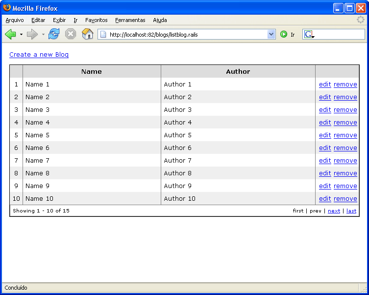

# ActiveRecord Integration

If you are using ActiveRecord you may consider using the integration we developed fo it. In order to do so, first of all, add a reference to the following assembly:

* Castle.MonoRail.ActiveRecordSupport

## The Main Players

### ARSmartDispatcherController

What we are about to discuss only works if you are using `ARSmartDispatcherController` instead of `SmartDispatcherController`. The `ARSmartDispatcherController` offers a `CustomBindObject` method that is `ActiveRecord`-aware.

#### ARDataBindAttribute and ARDataBinder

So imagine that you are creating a CRUD page for a `Customer` object. Creation is really simple, and the `DataBindAttribute` attribute is enough:

```csharp
public class CustomerController : ARSmartDispatcherController
{
    public void Index()
    {
    }

    public void New()
    {
    }

    public void Create([DataBind("customer")] Customer customer)
    {
        try
        {
            customer.Create();

            RedirectToAction("index");
        }
        catch(Exception ex)
        {
            Flash["error"] = ex.Message;

            RedirectToAction("new", Request.Form);
        }
    }
}
```

Now editing is the trick. You must load the `Customer` and populate the changes with the form data. Enter `ARDataBindAttribute`:

```csharp
public class CustomerController : ARSmartDispatcherController
{
    ...

    public void Edit(int id)
    {
        PropertyBag.Add("customer", Customer.Find(id));
    }

    public void Update([ARDataBind("customer", AutoLoad=AutoLoadBehavior.Always)] Customer customer)
    {
        try
        {
            customer.Update();

            RedirectToAction("index");
        }
        catch(Exception ex)
        {
            Flash["error"] = ex.Message;

            RedirectToAction("edit", Request.Form);
        }
    }
}
```

The ARDataBindAttribute extends the DataBindAttribute so the `Exclude` and `Allow` properties are still there.

However, as you can see, we used `AutoLoad=AutoLoadBehavior.Always`. This tells the binder to collect the primary key value for the customer and load it, then populate the object. So all you have to do next is to invoke the `Save` or `Update` method.

#### ARFetchAttribute

The `ARFetchAttribute` is a simpler version of `ARDataBinder`. It is in charge of loading the instance from the database and nothing more.

```csharp
public class CustomerController : ARSmartDispatcherController
{
    ...

    public void SetPassword([ARFetch("customer.id")] Customer customer, String newPassword)
    {
        try
        {
            customer.Password = newPassword;
            customer.Save();

            RedirectToAction("index");
        }
        catch(Exception ex)
        {
            Flash["error"] = ex.Message;

            RedirectToAction("changepassword", Request.Form);
        }
    }
}
```

The optional parameter passed to `ARFetch` tells it which form field has the primary key value. If you don't specify it, it will use the parameter name (for the example above it would be `customer`).

You can also specify `Required=true` which will force it to throw an exception if the record is not found:

```csharp
public class CustomerController : ARSmartDispatcherController
{
    ...

    public void SetPassword([ARFetch("customer.id", Required=true)] Customer customer, String newPassword)
    {
        ...
    }
}
```

And `Create=true`, which will create a new object if the primary key form field is empty:

```csharp
public class CustomerController : ARSmartDispatcherController
{
    ...

    public void CreateOrModifyCustomer([ARFetch("customer.id", Create=true)] Customer customer, String name, ...)
    {
        customer.Name = name;
        customer.Save();
    }
}
```

#### The AutoLoad Property

It is _very_ important that you know what the `AutoLoad` property means and the behavior it governs:

Enum field | Description
-----------|------------
`Never` | Means that no autoload should be performed on the target type or on nested types.
`Always` | Means that autoload should be used for the target type and the nested types (if present). This demands that the primary key be present on the http request for the root type and nested.
`OnlyNested` | Does not load the root type, but loads nested types if the primary key is present. If not present, sets null on nested type. This is useful for insertions.
`NewInstanceIfInvalidKey` | Means that we should autoload, but if the key is invalid, like null , 0 or an empty string, then just create a new instance of the target type.
`NullIfInvalidKey` | Means that we should autoload, but if the key is invalid, like null , 0 or an empty string, then just set null on the nested type.

## DataBinding with ActiveRecord

### DataBinding Issues

The combination of databinding and ActiveRecord opens the possibility for an error that is most often hit by unexperienced users, especially when using the recommended Session Per Request configuration for ActiveRecord. Consider the code from above:

```csharp
public void Update([ARDataBind("customer", AutoLoad=AutoLoadBehavior.Always)] Customer customer)
{
    try
    {
        customer.Update();

        RedirectToAction("index");
    }
    catch(Exception ex)
    {
        Flash["error"] = ex.Message;

        RedirectToAction("edit", Request.Form);
    }
}
```

Now, what happens if there is an exception? The exception is caught as intended and the error message added to the `Flash` container. But actually, you will get an ASP.NET errorpage nonetheless. The reason for this behaviour is simple once you know how the request is processed in the controller:

* An ActiveRecord `SessionScope` is created in `OnBeginRequest()`.
* The `customer` object will be looked up from database by its primary key.
* The properties of the `customer` object are updated through databinding.
* `customer.Update()` is called and throws an exception.
* The `catch` block executes.
* The ActiveRecord `SessionScope` is disposed in `OnEndRequest()`:
  * NHibernate checks whether there are pending changes.
  * The `customer` object is marked dirty, because its property values have been changed during databinding.
  * NHibernate flushes the session. During the flush, the changes of `customer` object are written back to the database.
  * An unhandled exception occurs.
* The exception cannot be handled in your controller and an errorpage is shown.

**ActiveRecord Validation:** The same issue appears when using ActiveRecord's validation support. Behaviour and reasons are identical in that case: The object is not saved but changed by the DataBinder and will be saved by NHibernate when the session is disposed.

So, now that the problem is known, how can it be handled? There are plenty possible solutions for this, depending on the user's needs:

* Make the session readonly and always flush it explicitly.
* Remove the offending object from the session.
* Create a TransactionScope and roll it back.
* Use the Validate option of ARDataBind

### Possible Solutions

#### Using a Read-Only Session

If you change the `SessionScope` to not automatically flush, changes are not flushed on disposal of the scope. You can setup the scope as shown below (based on [this article](http://using.castleproject.org/display/AR/Enable+Session+per+Request)):

```csharp
// GlobalApplication.cs
public void OnBeginRequest(object sender, EventArgs e)
{
    HttpContext.Current.Items.Add("nh.sessionscope", new SessionScope(FlushAction.Never);
}
```

Doing so requires you to flush your session manually in every controller that changes existing objects or introduces new objects to the database. There are two possibilities to get the session object to flush:

```csharp
// Use this when the session was added to the HttpContext in OnBeginRequest
((SessionScope)Context.Items["nh.sessionscope"]).Flush();
// Gets the session, if it is not stored in a known place.
ActiveRecordMediator
    .GetSessionFactoryHolder()
    .CreateSession(typeof(Customer))
    .Flush();
```

#### Removing Invalid Objects From the Session

Another possibility is to keep the default behaviour and only assure that invalid objects are not flushed on disposal of the session. This strategy is recommended when there are objects that need to be saved to the database even when one object is invalid and must not be stored.

You might also want to use this strategy when you are using Windsor integration and the ActiveRecordIntegration facility, because in this case you cannot change the session to be read-only within your code.

To remove the conflicting object from the `SessionScope`, you must `Evict` it:

```csharp
ActiveRecordMediator
    .GetSessionFactoryHolder()
    .CreateSession(typeof(Customer))
    .Evict(customer);
```

By using the `ActiveRecordMediator`, you will get access to the session regardless where it as been originally created.

#### Using TransactionScope

Another method is to wrap the validation in a transaction. If the validation fails, the transaction must be rolled back:

```csharp
using (TransactionScope tx = new TransactionScope())
{
    try
    {
        customer.Update();
        RedirectToAction("index");
    }
    catch(Exception ex)
    {
        Flash["error"] = ex.Message;
		tx.Rollback();
        RedirectToAction("edit", Request.Form);
    }
}
```

You might wonder how this works because I wrote above that the DataBinder makes the offending changes outside of the `TransactionScope`. The answer is that `TransactionScopes` can be nested and that there is an implicit transaction started during the creation of the `SessionScope`. The rollback is then propagated to that transaction and all changes are discarded.

However, that means that if you have other objects that must be saved, you should instead evict the invalid object as described above.

#### Validation During DataBinding

The most elegant method to circumvent such problems is the use of the `Castle Validation` component. By setting the parameter `Validate` of the `ARDataBind`-attribute to `true`, MonoRail performs validation of the input data before changing the properties based on the `Validate XXX`-Attributes of the ActiveRecord model classes.

The drawback is that invalid data is completely discarded and will not be redisplayed to the client by `FormHelper`. In order to access the data, `Request.Params` must be used:

```csharp
public void Update(
    [ARDataBind("customer",
        AutoLoadBehavior.NewRootInstanceIfInvalidKey,
        Validate = true)] Customer customer)
{
    if (ValidationSummaryPerInstance[info].ErrorsCount > 0)
    {
        string msg = "Please correct errors:";
        foreach (string p in ValidationSummaryPerInstance[customer].InvalidProperties)
        {
            msg += "<p>" + p + ":</p>";
            foreach (string m in ValidationSummaryPerInstance[customer].GetErrorsForProperty(p))
            {
                msg += string.Format("<p>{0}</p>", m);
            }
        }
        Flash["message"] = msg;
        Flash["customer"] = customer;
        RedirectToReferrer();
        return;
    }
	// "Normal" application flow
	// ...
}
```

## ActiveRecord Scaffolding

This support still on its early stages and has been refactored twice. Nevertheless it's quite good to create prototype applications in no time. Its implementation allow you to override the views if you want, so the scaffolding will handle only the CRUD.

The scaffolding support basically relies on `Dynamic Actions` to do its magic. It adds dynamic actions to your controller based on the name of the target ActiveRecord class. Some of the virtual actions might use a view, and if so you are allowed to provide your own views instead of letting it generate the html for you.

Here is a list of the actions added dynamically:

* new: Presents a form to the user fill in order to create the item on the database
* create: Takes the information submited by the newAccount and creates the item
* edit: Presents a form to the user fill in order to update the item on the database
* update: Takes the information submited by the editAccount and changes the item
* list: Presents a paginated list of items saved
* confirm: Asks the user if he/she confirms the removal of the item
* remove: Attempt to remove the item and presents the results

If more than one `ScaffoldingAttribute` is associate with a controller, then the actions will have the entity name:

* new<typename>: Presents a form to the user fill in order to create the item on the database
* create<typename>: Takes the information submited by the newAccount and creates the item
* edit<typename>: Presents a form to the user fill in order to update the item on the database
* update<typename>: Takes the information submited by the editAccount and changes the item
* list<typename>: Presents a paginated list of items saved
* confirm<typename>: Asks the user if he/she confirms the removal of the item
* remove<typename>: Attempt to remove the item and presents the results

### Required Assemblies

The required assemblies are:

* Castle.Components.Common.TemplateEngine
* Castle.Components.Common.TemplateEngine.NVelocityTemplateEngine
* Castle.MonoRail.ActiveRecordScaffold
* Castle.MonoRail.ActiveRecordSupport
* NVelocity

And the ActiveRecord assemblies:

* Castle.ActiveRecord
* Iesi.Collections
* NHibernate
* log4net

There is no configuration beyond that of ActiveRecord required. For further information on configuring ActiveRecord see the ActiveRecord documentation.

### ScaffoldingAttribute

Now you can create a controller (or use an existing one) and add the `ScaffoldingAttribute` pointing to an ActiveRecord class. Suppose you have the following ActiveRecord class:

```csharp
[ActiveRecord("Blogs")]
public class Blog : ActiveRecordValidationBase
{
    private int _id;
    private String _name;
    private String _author;

    [PrimaryKey(PrimaryKeyType.Native)]
    public int Id
    {
        get { return _id; }
        set { _id = value; }
    }

    [Property, ValidateNotEmptyAttribute]
    public String Name
    {
        get { return _name; }
        set { _name = value; }
    }

    [Property, ValidateNotEmptyAttribute]
    public String Author
    {
        get { return _author; }
        set { _author = value; }
    }

    public static void DeleteAll()
    {
        ActiveRecordBase.DeleteAll( typeof(Blog) );
    }

    public static Blog[] FindAll()
    {
        return (Blog[]) ActiveRecordBase.FindAll( typeof(Blog) );
    }

    public static Blog Find(int id)
    {
        return (Blog) ActiveRecordBase.FindByPrimaryKey( typeof(Blog), id );
    }
}
```

You can then create a BlogsController like this:

```csharp
[Scaffolding( typeof(Blog) )]
public class BlogsController : Controller
{
}
```

Now point your browser to your controller, and to an action called list.rails like

```
http://localhost/blogs/list.rails
```

### List

The image below is the default list rendered if you have used the stylesheet and layout mentioned before:



If you want to supply your own view, add a file name `list<typename>.vm` on the view folder for the controller. The following data will be available to your view on the `PropertyBag`:

* items: a paginated list of items
* model: The `ActiveRecordModel` instance for the target type
* keyprop: A `PropertyInfo` of the property that is the primary key
* properties: A list of `PropertyInfo`

### Add

The image below is the default new entry page rendered if you have used the stylesheet and layout mentioned before:


If you want to supply your own view, add a file name `new<typename>.vm` on the view folder for the controller. The following data will be available to your view on the `PropertyBag`:

* instance: A newly created instance of the target type
* armodel: The `ActiveRecordModel` instance for the target type

### Edit

The image below is the default edit entry page rendered if you have used the stylesheet and layout mentioned before:


If you want to supply your own view, add a file named `edit<typename>.vm` on the view folder for the controller. The following data will be available to your view on the `PropertyBag`:

* instance: A newly created instance of the target type
* armodel: The ActiveRecordModel instance for the target type

### Remove

The default rendered page will ask for confirmation on the removal. If you want to supply your own view, add a file named `confirm<typename>.vm` on the view folder for the controller. The following data will be available to your view on the `PropertyBag`:

* instance: A newly created instance of the target type
* armodel: The ActiveRecordModel instance for the target type
* id: The value of the primary key that identifies the record

### Complex Models

Complex models should be supported. For example, the following is a page rendered for a `Person` type that uses inheritance and nested types (what NHibernate calls Components):

