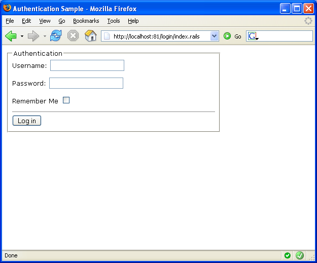
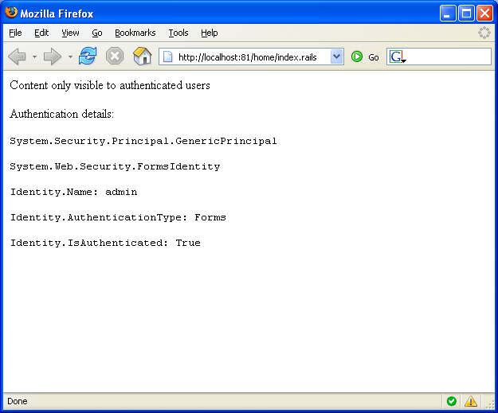
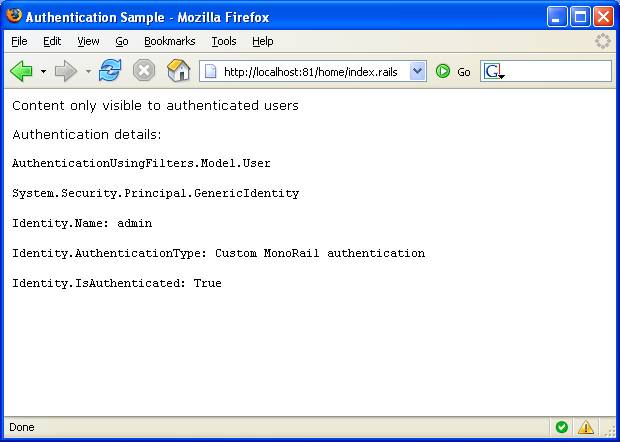

# Authentication and Authorization

MonoRail does not provide a standard way to accomplish authentication nor authorization. This is intentional as MonoRail runs on top of ASP.NET infrastructure which provides standard way to handle both, like the `FormsAuthentication` and the `<authorization>` configuration element.

That being said, you can also use Filters to implement authentication if you want. All you have to do is associate an authentication filter with the controllers that can only be accessed by authenticated users.

## Forms Authentication

When you use `FormsAuthentication` you leverage to Asp.Net to handle the authentication, or the cookie and principal implementation or both.

If you want to use it, first thing to do is say which resources can only be accessed by authenticated users. Note that from ASP.NET point of view, a controller is also a resource.

To configure that, use `<authorization>` configuration element on the `web.config` (we are using it on `web.config` on the root folder):

```xml
<?xml version="1.0" encoding="utf-8"?>
<configuration>
  <location path="home">
    <system.web>
      <authorization>
        <deny users="?"/>
      </authorization>
    </system.web>
  </location>
  ...
```

With the configuration above we are saying that the controller `Home` cannot be reached by anonymous users.

Now that the resources are protected we can configure the `FormsAuthentication` support. In order to be really simple, we even manage the usernames and passwords allowed on the configuration file too:

```xml
<?xml version="1.0" encoding="utf-8"?>
<configuration>
  ...
  <system.web>
    <authentication mode="Forms">
      <forms name="auth" loginUrl="login/index.rails">
        <credentials passwordFormat="Clear">
          <user name="admin" password="admin" />
          <user name="user" password="user" />
        </credentials>
      </forms>
    </authentication>
    ...
```

The configuration defines that when authentication is needed, ASP.NET should redirect the user to `login/index.rails` which is our `LoginController`, action `index`. There we present our login form:



The authentication code relies on the `FormsAuthentication`:

```csharp
using System.Web.Security;
using Castle.MonoRail.Framework;

[Layout("default")]
public class LoginController : SmartDispatcherController
{
    public void Index()
    {
    }

    public void LogIn(string username, string password, bool rememberme, string ReturnUrl)
    {
        if (FormsAuthentication.Authenticate(username, password))
        {
            CancelView();

            FormsAuthentication.RedirectFromLoginPage(username, rememberme, Context.ApplicationPath);
        }
        else
        {
            // If we got here then something
            // is wrong with the supplied username/password

            Flash["error"] = "Invalid user name or password. Try again.";
            RedirectToAction("Index", "ReturnUrl=" + ReturnUrl);
        }
    }
}
```

Once authenticated, we can navigate to the protected resource:



## Authentication Using Filters

When using filters the options are wide. You can rely on the session, you can rely on cookies; you may want to provide an implementation of `IPrincipal` and supply the roles yourself to have a more fine-grained permission control.

The approach demonstrated here uses a custom implementation of `IPrincipal` on the `User` class and uses the session to persist the authentication among requests. Implementing a "remember me" feature would require a cookie. It was not implemented to keep the example as simple as possible.

Authentication control with filters is just a matter of associating an authentication filter with the controllers you do not want to be accessed by anonymous users. This only restricts access to controller's actions. If you want to protect files, you might use a mix of filters and `FormsAuthentication` or implementing the `Authenticate_Request event.

In our example we want to prevent access to the `HomeController`. So we associate a `BeforeAction` filter with it:

```csharp
using AuthenticationUsingFilters.Filters;
using Castle.MonoRail.Framework;

[Layout("default")]
[Filter(ExecuteEnum.BeforeAction, typeof(AuthenticationFilter))]
public class HomeController : SmartDispatcherController
{
    public void Index()
    {
    }
}
```

The filter implementation can do a number of things to check if the current user is authenticated. We decided to check if an existing object exists in the session. The object implements `IPrincipal` but this is not required. The implementation will vary depending on the requirements and how you plan to handle authorization.

```csharp
using System.Collections.Specialized;
using AuthenticationUsingFilters.Model;
using Castle.MonoRail.Framework;

public class AuthenticationFilter : IFilter
{
    public bool Perform(ExecuteEnum exec, IRailsEngineContext context, Controller controller)
    {
        // Read previous authenticated principal from session
        // (could be from cookie although with more work)

        User user = (User) context.Session["user"];

        // Sets the principal as the current user
        context.CurrentUser = user;

        // Checks if it is OK
        if (context.CurrentUser == null || !context.CurrentUser.Identity.IsAuthenticated)
        {
            // Not authenticated, redirect to login
            NameValueCollection parameters = new NameValueCollection();
            parameters.Add("ReturnUrl", context.Url);
            controller.Redirect("login", "index", parameters);

            // Prevent request from continue
            return false;
        }

        // Everything is ok
        return true;
    }
}
```

The `LoginController` will not be much different from the previous example:

```csharp
using AuthenticationUsingFilters.Model;
using Castle.MonoRail.Framework;

[Layout("default")]
public class LoginController : SmartDispatcherController
{
    public void Index()
    {
    }

    public void LogIn(string username, string password, bool rememberme, string ReturnUrl)
    {
        // We should authenticate against a database table or something similar
        // but here, everything is ok as long as the
        // password and username are non-empty

        if (IsValid(username, password))
        {
            CancelView();

            // Ideally we would look up an user from the database
            // The domain model that represents the user
            // could implement IPrincipal or we could use an adapter

            User user = new User(username, new string[0]);

            Session["user"] = user;

            Redirect(ReturnUrl);
        }
        else
        {
            // If we got here then something is wrong
            // with the supplied username/password

            Flash["error"] = "Invalid user name or password. Try again.";
            RedirectToAction("Index", "ReturnUrl=" + ReturnUrl);
        }
    }

    private bool IsValid(string username, string password)
    {
        return username != null && password != null;
    }
}
```

If the authentication passes we just create the `User` and add it to the session, allowing the filter to get it for the subsequent requests. The User class is just a simple implementation of `IPrincipal`. Real applications will use an adapter or change an existing class that represents a logged user, or system user to implement it as well.

```csharp
public class User : IPrincipal
{
    private string[] roles;
    private IIdentity identity;

    public User(String name, String[] roles)
    {
        identity = new GenericIdentity(name, "Custom MonoRail authentication");
        this.roles = roles;
    }

    public bool IsInRole(string role)
    {
        return Array.IndexOf(roles, role) >= 0;
    }

    public IIdentity Identity
    {
        get { return identity; }
    }
}
```

Compared with the previous example, the data outputted is a little bit different:



## Authentication Using PrincipalPermission

If you have a custom implementation of `IPrincipal` or even if you use the `GenericPrincipal` but supply the roles, you would be able to use `PrincipalPermission` to prevent users from invoking methods or code branches.

**Set on current thread too:** In addition to setting the principal implementation on the `HttpRequest` (which is what `context.CurrentUser` does) you must also set the principal on the current thread by using `System.Threading.Thread.CurrentPrincipal`.

The `PrincipalPermission` and `PrincipalPermissionAttribute` belong to the .NET security infrastructure and demands that the executing principal has a specific role. This can be used as the last resource to secure your application.

For example, suppose your application is clever enough to not offer links to resources/actions the user does not have access to. However, this is commonly refered to as 'security by obscurity', as a user that knows how to get to the resource will be able to access them. To secure the application from this kind of access you might use `PrincipalPermission`. For example:

```csharp
using System.Security;
using Castle.MonoRail.Framework;

public class OrderController : SmartDispatcherController
{
    [PrincipalPermission(SecurityAction.Demand, Role="Administrator")]
    public void DeleteOrder(int orderid)
    {
        ...
    }
}
```

If the current user does not have the role `Administrator` a `SecurityException` will be thrown.

## The Security Component

MonoRail comes with a `ViewComponent` called `SecurityComponent` which can be used on views to prevent rendering contents based on the roles the current user (principal) has. For example:

```
#blockcomponent(SecurityComponent with "role=Administrator")

This content can only be seen by administrators

#end
```