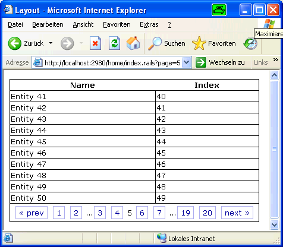
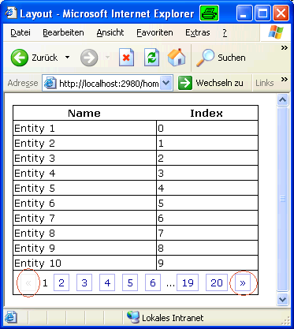
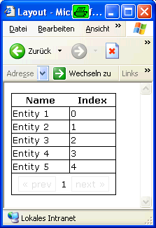
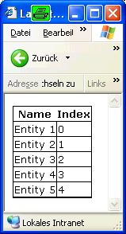
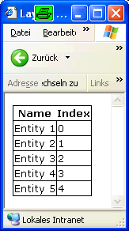
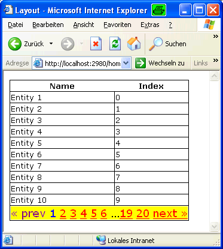

# DiggStylePagination

The DiggStylePagination component allows to create standardized but customizable pagination links for use with MonoRail's `PaginationHelper`.

## Basic Usage

Suppose you have a list of about 200 items to display. Using MonoRail it is easy to create a pagination for that items, such that only 20 at a time are displayed:

```csharp
public class HomeController : SmartDispatcherController
{
	public void Index()
	{
            PropertyBag["items"] =
                PaginationHelper.CreatePagination<MyEntity>(
                    this, // controller
                    MyEntity.FindAll(new Order("Index", true)), // list
                    10 // number of items per page
                );
	}
}
```

`items` is an instance of `IPaginatedPage`. It can be used like a list in NVelocity templates. Additionally, it has properties to determine the current status of the pagination. These properties can be used to create pagination links, which is described in the `PaginationHelper` documentation.

However, building pagination links is a repeating task that should be automated. This is what the DiggStylePaginationComponent does:

```html
<table>
	<tr>
		<th>Name</th>
		<th>Index</th>
	</tr>
#foreach($row in $items)
	<tr>
		<td>$row.Name</td>
		<td>$row.Index</td>
	</tr>
#end
	<tr>
    	<td colspan="2">
#component(DiggStylePagination with "page=$items")
		</td>
	</tr>
</table>
```

This creates a production ready pagination line as shown in the picture below:



## Customizing Captions

When creating a non-english application, the labels &laquo; prev and next &raquo; don't make any sense. This can be changed by using a `DiggStylePagination` blockcomponent and sections to customize the link text:

```html
...data same as above...
<tr>
    <td colspan="2">
#blockcomponent(DiggStylePagination with "page=$items")
    #prev
        &laquo;
    #end
    #next
        &raquo;
    #end
#end
    </td>
</tr>
```

You can see the results below. Pay attention to encircled links:



## Suppressing Display

The problem is that if there are less items than the specified page size, the pagination is still displayed:



This can be suppressed by specifiying the parameter `RenderIfOnlyOnePage`.

```html
...data same as above...
<tr>
    <td colspan="2">
#component(DiggStylePagination with "page=$items" "renderifonlyonepage=false")
    </td>
</tr>
```

This removes the pagination itself from the page, but the surrounding table cell is still rendered. In this example this is visible by a thicker bottom border, but depending on the stylesheet this might lead to more ugly effects:



To prevent this, it is possible to render the surrounding HTML by using the sections `startblock` and `endblock`. That way the HTML is only rendered when the pagination is needed:

```html
...data same as above...
#blockcomponent(DiggStylePagination with "page=$items" "renderifonlyonepage=false")
#startblock
<tr>
    <td colspan="2">
#end
#endblock
    </td>
</tr>
#end
#end
```



## Changing Link Styles

Rectangular, button-like links are perhaps not your preferred style of displaying the pagination. When you need to change the way links are displayed, you must do so by using CSS classes.

`DiggStylePaginationComponent` emits the style within the HTML links, so you need to both specify CSS classes and force the component to use these classes.

```html
...data same as above...
<tr>
    <td colspan="2">
#component(DiggStylePagination with "page=$items" "useinlinestyle=false")
    </td>
</tr>
```

This results in the following HTML rendered:

```html
<div class="pagination">
	<span class="disabled">&laquo; prev</span>
	<span class="current">1</span>
	<a href="/home/index6.rails?page=2">2</a>
	<a href="/home/index6.rails?page=3">3</a>
	<a href="/home/index6.rails?page=4">4</a>
	<a href="/home/index6.rails?page=5">5</a>
	<a href="/home/index6.rails?page=6">6</a>
	&#8230;<a href="/home/index6.rails?page=19">19</a>
	<a href="/home/index6.rails?page=20">20</a>
	<a href="/home/index6.rails?page=2">next &raquo;</a>
</div>
```

This allows you to customize the output using the following CSS classes:

* pagination for the complete box containing the pagination.
* disabled for buttons that are not disabled.
* current for displaying the current page number.

Additionally, you must specify CSS commands for .pagination if you want to customize the links themselves.

Here is a comprehensive example that shows all four options:

```html
<style type="text/css" media="screen">
    .pagination {
        /* Complete box */
        background-color: yellow;
        font-size: large;
    }

    .pagination a {
        /* links */
        color: red;
    }

    .disabled {
        /* disabled "buttons" */
        color: purple;
    }

    .current {
        /* current page */
        color: blue;
    }
</style>
```

This one renders like shown below:



## Changing the Number of Links Displayed

If you have a look at the pictures above, you might have noticed that not all pages are linked. By default, only the two pages before and after the current page are linked directly to save space. It is possible to customize the number of links to be displayed on each side of the current page before the ellipsis with the parameter `adjacents`.

However, the algorithm used doesn't work well with large numbers, so you should use one of the following values:

* 0 or 1 for very narrow tables
* 3 for wide tables with a small number of expected pages. This setting suppresses rendering ellipsis for less than ten pages.
* 2 or nothing (it is the default) for the rest.

## Customizing Actions

So far, we have only changed how the links are displayed. This is good enough for simple pages, but if you provide means of searching or filtering the data, you must come up with a possibility to save the parameters for fetching data of the different pages.

Though it is not directly visible to the programmer, any time a different page is displayed, there is a roundtrip to the server using the original controller action. This means that for paging search results, you must pass the search parameters to the controller along with the pagination links.

This can be done using different techniques:

* Storing the search or filter params in the sessions. Some users are quite fond of this, because they always need the same subset of results. Others, however, are constantly searching for "disappeared" rows, so you should not use session variables only for round-trip-conservation of parameters.
* Adding the search parameters to the URL of the page links. This is the preferable solution for most simple searches and filters.

Calling a JavaScript function from the links. Then use either AJAX for exchanging the rows to be displayed or construct an URL using JavaScript.

## Adding Parameters to the URL

The simplest method is specifying the URL to invoke by using the `url` parameter of the `DiggStylePaginationComponent`. This allows you to add the needed query params.

If you look at the example of doing this below, you should notice that the URL is assembled in an extra `#set`-statement. This is intentional; you cannot specify a string as parameter value that contains parameters itself.

```html
<table>
	<tr>
		<th>Name</th>
		<th>Index</th>
	</tr>
#foreach($row in $items)
	<tr>
		<td>$row.Name</td>
		<td>$row.Index</td>
	</tr>
#end
	<tr>
		<td colspan="2">
#set ($url="index8.rails?desc=$desc")
#component(DiggStylePagination with "page=$items" "url=$url")
## The statement below won't work!
##component(DiggStylePagination with "page=$items" "url='index8.rails?desc=$desc'")
		</td>
	</tr>
</table>
<a href="index8.rails">Ascending list</a> &mdash;
<a href="index8.rails?desc=true">Descending list</a>
```

## Javascript Functions as Link Targets

From the pagination side of view, this is dead simple. Just specify the name of a JavaScript function defined elsewhere in the page and it will be called with the page number as a parameter on every pagination link click.

DiggStylePagination however doesn't help with consuming this information, so it is not recommended unless you are using AJAX nonetheless.

```html
...data same as above...
<tr>
    <td colspan="2">
#component(DiggStylePagination with "page=$items" "paginatefunction=foo")
    </td>
</tr>
[script type="text/javascript">
    function foo(page)
    {
        var a = new AjaxMagicObject();
        a.page = page;
        a.fetchAndDisplayData();
    }
</script>
```

DiggStylePagination will render this as `javascript:foo(page);void(0);`, so you really need to specify only the function name.

## Building Links with #link

If all else fails, you can provide a block for creating the links. Just be warned, this should really be used only if all else fails; because there is no automation, you need to create all the HTML by yourself.

To build your links, you get the following variables as parameters:

* `$pageIndex` contains the page number of the link to render.
* `$url` contains the url to the controller action. If it wasn't specified via the url-parameter discussed above, it is simple an URL to the current page.
* `$text` contains the text that would have been rendered by the default render functions. This is either a number, prev, next or a custom text specified using #prev or #next .

To get a working pagination, you must not forget to pass a parameter named `page` to the controller action.

Using `#link` has the caveat, that it is not called for

* rendering the current page
* rendering ellipsis
* rendering disabled links

The following examples renders all links as buttons. The (imperfect) result is shown below:

```html
<tr>
    <td colspan="2">
#blockcomponent(DiggStylePagination with "page=$items")
#link
<button type="button" onclick="location.href='$url?page=$pageIndex';">$text</button>
#end
#end
    </td>
</tr>
```