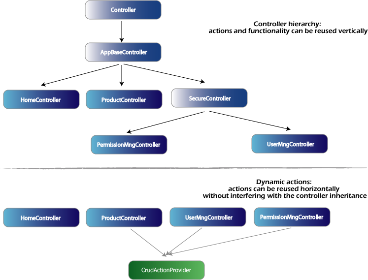

# Dynamic Actions

Dynamic actions and action providers are a way to create custom and dynamic functionality.

MonoRail considers every public instance method of a controller an action, for certain situations this is not enough. For example, you want to decide on the name for a section in the URL at runtime when the data is available; or a set of controllers that inherit from a distinct common super class need the same action which can be defined in the super class.

Dynamic Actions are a way to associate code with a name in runtime.



A dynamic action is nothing more than an implementation of the interface `IDynamicAction`:

```csharp
public interface IDynamicAction
{
    /// <summary>
    /// Implementors should perform the action
    /// upon this invocation
    /// </summary>
    void Execute(Controller controller);
}
```

You can associate a dynamic action with a controller using the `DynamicActions` property:

```csharp
public class MyController : Controller
{
    public MyController
    {
        DynamicActions["index"] = new IndexDynamicAction();
    }
}
```

## Dynamic Action Providers

Dynamic Action Providers are in charge of adding dynamic actions to controllers. They can be associated with controllers using the `DynamicActionAttribute`:

```csharp
[DynamicAction(typeof(MyDynActionProvider))]
public class MyController : Controller
{
    public MyController
    {
    }
}
```

The implementation of the provider can be something static (i.e. always add the same set of actions) or can "read" something from the controller or the logged user; and add the actions accordingly:

```csharp
public class MyDynActionProvider : IDynamicActionProvider
{
    public void IncludeActions(Controller controller)
    {
        controller.DynamicActions["index"] = new IndexDynamicAction();
    }
}
```