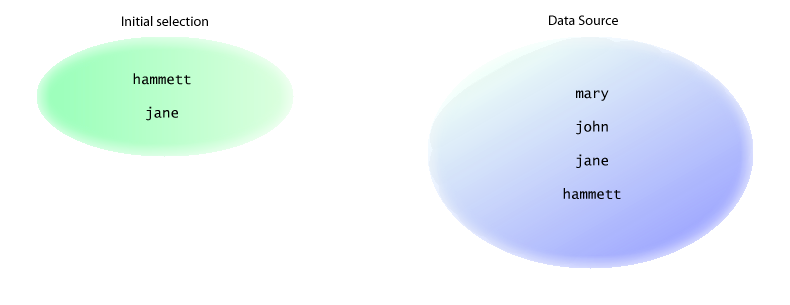
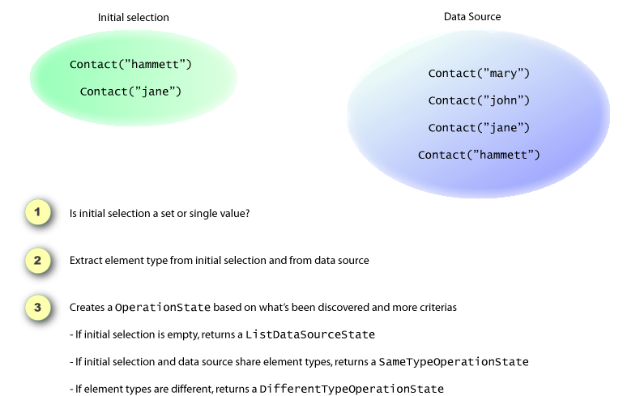

# FormHelper

The FormHelper allows you to output Html Input elements using the conventions necessary to use the `DataBinder` on the server side. It also queries the objects available on the context to automatically populate values correctly, saving you the burden of filling inputs, selects, checkboxes and radios.

The helper is inspired on two exquisite works: the Ruby on Rails' `FormHelper` and the Apache Jakarta `Taglibs`. The idea is to generate html form elements while:

* Using the same naming convention used by the `DataBinder` on the controller side
* Collect the value from an instance in the context (if available) and populate the html element with the value or selection

When using the `FormHelper` you specify a target through a string. The target is evaluated and if the object is available in the context then the evaluation result is used to provide the correct output. For a simple text input element, the evaluated value will be the value of the textbox.

## Getting Started

Using the `FormHelper` is easy and in a few minutes you will understand how it works. Just remember that it requires that the controller and the view work together.

The goal is to generate proper Html elements that can be easily databound on the controller side. The most trivial case is binding single values. For example, you can have a view like the following (using NVelocity View Engine):

```
<form action="Index.rails" method="post">
  $FormHelper.TextField("name")
  $FormHelper.TextField("address")
</form>
```

Whenever this view is rendered, the `FormHelper`'s `TextField` method will be invoked. The first thing it does is extract the root target. In the case above the targets are not chained, so the roots will be `name` and `address`.

After that it will search in the context dictionaries for the roots, in the following order:

* PropertyBag
* Flash
* Session
* Request.Params
* HttpContext.Items

If it finds the entry, it will extract the value and use it. If it doesn't find the entry, no value will be set on the html element.

Suppose the action using the view above (the form definition) is the following:

```csharp
public void Index()
{
}
```

For this case, the html output will be:

```html
<form action="Index.rails" method="post">
  <input type="text" id="name" name="name" value="" />
  <input type="text" id="address" name="address" value="" />
</form>
```

Note the "`value`" property of both input elements is blank.

However, if the action was:

```csharp
public void Index()
{
    PropertyBag.Add("name", "hammett");
    PropertyBag.Add("address", "pereira leite, 44");
}
```

Then the `FormHelper` would have the values filled:

```html
<form action="Index.rails" method="post">
  <input type="text" id="name" name="name" value="hammett" />
  <input type="text" id="address" name="address" value="pereira leite, 44" />
</form>
```

The support for autmatically populating Html elements goes beyond input fields. See below for more information on the `FormHelper`.

## Complex Objects

Consider a different action code now:

```csharp
public void Index()
{
    PropertyBag.Add("contact", new Contact("john", "some address", "phone number") );
}
```

A view for this

```
<form action="Index.rails" method="post">
  $FormHelper.TextField("contact.name")
  $FormHelper.TextField("contact.address")
  $FormHelper.TextField("contact.phone")
</form>
```

The `FormHelper` will find the contact entry in the `PropertyBag`, and then find the properties `name`, `address` and `phone`. It will extract the values from the item in the `PropertyBag` and render the view accordingly:

```html
<form action="Index.rails" method="post">
  <input type="text" id="contact_name" name="contact.name" value="john" />
  <input type="text" id="contact_address" name="contact.address" value="some address" />
  <input type="text" id="contact_phone" name="contact.phone" value="phone number" />
</form>
```

## Arrays

Arrays are also supported. Suppose you have the following action code:

```csharp
public void Index()
{
    PropertyBag.Add("list", new string[] {
        "value 1",
        "value 2"
    });

    PropertyBag.Add("contacts", new Contact[] {
        new Contact("john", "address 1", "phone number 1"),
        new Contact("mary", "address 2", "phone number 2")
    });
}
```

In this case you have to use the indexed name convention as the target so `FormHelper` can know from which index it should extract the value:

```
<form action="Index.rails" method="post">

$FormHelper.TextField("list[0]")
$FormHelper.TextField("list[1]")

$FormHelper.TextField("contacts[0].name")
$FormHelper.TextField("contacts[0].address")
$FormHelper.TextField("contacts[0].phone")

$FormHelper.TextField("contacts[1].name")
$FormHelper.TextField("contacts[1].address")
$FormHelper.TextField("contacts[1].phone")

</form>
```

The `FormHelper` will use the `index` value to find the correct entry. It will generate something like the following:

```html
<form action="Index.rails" method="post">

<input type="text" id="list_0_" name="list[0]" value="value 1" />
<input type="text" id="list_1_" name="list[1]" value="value 2" />

<input type="text" id="contact_0_name" name="contact[0].name" value="john" />
<input type="text" id="contact_0_address" name="contact[0].address" value="address 1" />
<input type="text" id="contact_0_phone" name="contact[0].phone" value="phone number 1" />

<input type="text" id="contact_1_name" name="contact[1].name" value="mary" />
<input type="text" id="contact_1_address" name="contact[1].address" value="address 2" />
<input type="text" id="contact_1_phone" name="contact[1].phone" value="phone number 2" />

</form>
```

## Working with Sets

`FormHelper` supports a broad range of scenarios when dealing with sets. Sets are used when `Select` and `CheckboxList` are generated. It is adamant that you know how it works when dealing with sets.

For `Select` and `CheckboxList` generation, the common target is considered the _initial selection set_. The value supplied as the _data source_ is treated as the complete set. The initial selection must be a _subset_ of the data source set.



This is very obvious and works nicely when both sets are composed of primitives and both sets have same types. But not every application has this scenario to work with.

The `FormHelper` makes a few verifications which help it to decide on an approach based on the sets available. See the image below:



If the types are not primitive types, it is up to the programmer to inform the property the element has that identifies the instance, using the `value` parameter. The programmer can also specify the `text` parameter which is used to identify the property that returns a descriptive text about the element instance.

The `sourceProperty` parameter is used to identity the property that should be used on the html element. This is only helpful when the types are different and the identification property on the data source element is different from the identification property on the initial selection elements.

The `suffix` parameter is used to override the suffix used on the generated element names. `FormHelper` will always try to use the value specified for the `value` parameter which is right for almost all situations, but one: when you are dealing with different types on the sets but the initial set is null and the `FormHelper` won't be able to identify that. So if you have different types and you know in advance that the initial set can be empty or null, specify the `suffix` parameter.

## Generating Selects

`FormHelper` is able to generate single and multi-value selects. Make sure you have read "How FormHelper works with sets".

### Single Value Selects

To create a select just specify the target and the data source. Consider the following action code:

```csharp
public void Index()
{
    // data source
    PropertyBag["primenumbers"] = new int[] { 2, 3, 5, 7, 11, 13, 17, 19, 23, 29, 31, 37, 41, 43, 47 };

    // initial selection
    PropertyBag["oneprime"] = 3;
}
```

The code on the view to use it would be:

```
$FormHelper.Select("oneprime", $primenumbers)
```

With complex objects you must care to specify the value and text parameters so the `FormHelper` can generate proper html elements. Consider the following action code:

```csharp
public void Index()
{
    // data source
    IList authors = new Author[] {
        new Author(1, "hammett"),
        new Author(2, "john doe"),
        new Author(3, "someone else")
    };
    PropertyBag["authors"] = authors;

    // initial selection
    Blog blog = new Blog();
    blog.Author = new Author(1, "hammett");
    PropertyBag["blog"] = blog;
}
```

The `Author` class above has an `Id` property and `Name` property. So here is how the view would use it:

```
$FormHelper.Select("blog.author.id", $authors, "%{value='id', text='Name', firstoption='Please select'}")
```

Note the use of `firstoption` parameter. It includes the specified content as the first available option on the select.

### Multi-Value Selects

Multi-value selects are not very different from what we have seen so far. The initial selection however will be a set. Consider the following action code:

```csharp
public void Index()
{
    // data source
    PropertyBag["primenumbers"] = new int[] { 2, 3, 5, 7, 11, 13, 17, 19, 23, 29, 31, 37, 41, 43, 47 };

    // initial selection
    PropertyBag["multipleprimes"] = new int[] { 3, 5, 7 };
}
```

Here is how the view would use it:

```
$FormHelper.Select("multipleprimes", $primenumbers, "%{multiple='true', style='width: 110px; height: 90px;'}")
```

Note that the `multiple` parameter is required to generate a html element prepared for multiple selection.

## Creating Checkbox Lists

FormHelper allows you to generate a list of checkboxes associated with a data source. It is also able to pre-check the checkboxes based on the initial selection set. Make sure you have read "How FormHelper works with sets".

Listing checkboxes requires a state object. To create it you invoke `CreateCheckboxList` which returns a `CheckboxList` instance. A `CheckboxList` is enumerable and exposes an `Item` and a `LabelFor` method. You must enumerate the elements and while doing it invoke `Item` which returns the checkbox element. `LabelFor` adds a label-tag to the caption that allows the user to click the caption as well as the checkbox itself.

```csharp
public void Index()
{
    // data source
    PropertyBag["primenumbers"] = new int[] { 2, 3, 5, 7, 11, 13, 17, 19, 23, 29, 31, 37, 41, 43, 47 };

    // initial selection
    PropertyBag["selectedPrimes"] = new int[] { 11, 19, 29 };
}
```

The code on the view to use it would be:

```
<p>
#set($items = $FormHelper.CreateCheckboxList("selectedPrimes", $primenumbers))

#foreach($elem in $items)
  $items.Item() $items.LabelFor($elem) <br/>
#end
</p>
```

With complex objects you must care to specify the `value` parameter so the `FormHelper` can generate proper html elements:

```csharp
public void Index()
{
    // data source
    Category[] categories = new Category[] {
        new Category(1, "Music"),
        new Category(2, "Humor"),
        new Category(3, "Politics")
    };
    PropertyBag["categories"] = categories;

    // initial selection
    Blog blog = new Blog();
    blog.Categories = new Category[] {
        new Category(2, "Humor")
    };
    PropertyBag["blog"] = blog;
}
```

The Category class above has an `Id` property and `Name` property. So here is how the view would use it:

```
<p>
#set($items = $FormHelper.CreateCheckboxList("blog.categories", $categories, "%{value='Id'}"))

#foreach($elem in $items)
  $items.Item()  $elem.Name   <br/>
#end
</p>
```