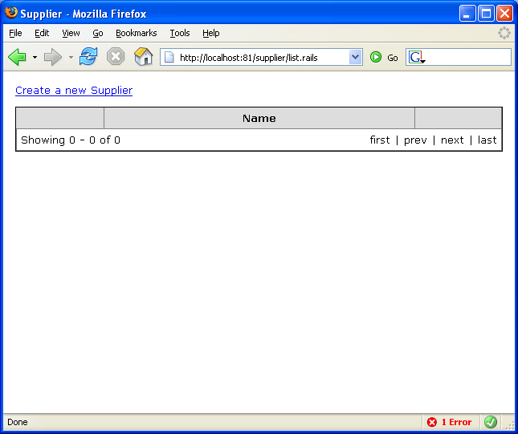
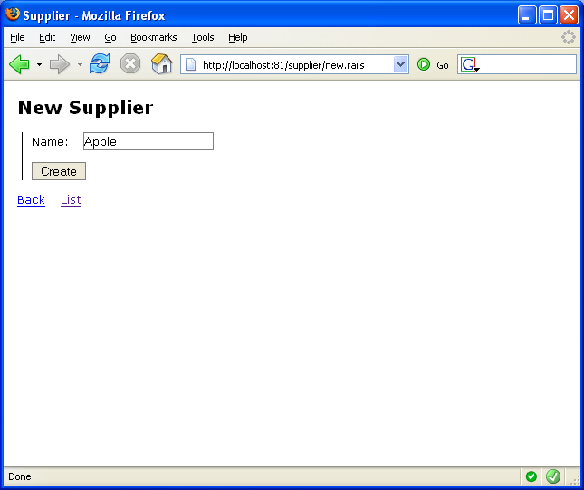
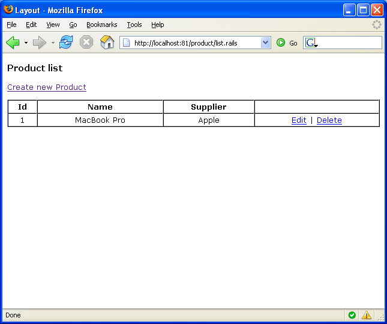
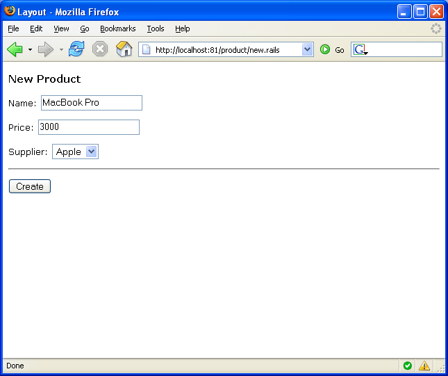

# Getting Started with ActiveRecord Integration

In order to explore some more realistic scenarios you will face during daily development lets take a look at using ActiveRecord for reading and writing data stored in a database. The Castle ActiveRecord project is an implementation of the ActiveRecord pattern for .NET that uses [NHibernate](http://www.hibernate.org/) to communicate with the database.

To add ActiveRecord support to the sample project we will reference the required assemblies, set up a database and finally configure and initialize ActiveRecord.

**ActiveRecord documentation:** For more information on ActiveRecord see the [ActiveRecord documentation](http://www.castleproject.org/projects/activerecord/).

## Assemblies

First, add references to the assemblies required to use ActiveRecord in your project:

* Castle.ActiveRecord.dll
* Castle.DynamicProxy.dll
* Iesi.Collections.dll
* log4net.dll
* NHibernate.dll

## Configuration

Now we need to add the ActiveRecord configuration elements to the `web.config` in the project:

```xml
<configuration>
	<configSections>

		...

		<section
			name="activerecord"
			type="Castle.ActiveRecord.Framework.Config.ActiveRecordSectionHandler, Castle.ActiveRecord" />

	</configSections>

	<activerecord isWeb="true">

		<config>
			<add
				key="hibernate.connection.driver_class"
				value="NHibernate.Driver.SqlClientDriver" />
			<add
				key="hibernate.dialect"
				value="NHibernate.Dialect.MsSql2000Dialect" />
			<add
				key="hibernate.connection.provider"
				value="NHibernate.Connection.DriverConnectionProvider" />
			<add
				key="hibernate.connection.connection_string"
				value="Data Source=.;Initial Catalog=test;Integrated Security=SSPI" />
		</config>

	</activerecord>

	...
```

The configuration above defines the section handler that tells ActiveRecord how to find and interpret the ActiveRecord configuration information followed by the configuration section itself.

**Other databases:** For our sample we've used SQL Server 2000, however since ActiveRecord uses NHibernate it can support any database dialect that NHibernate supports. If you are using a different database you want to change the dialect please refer to the [ActiveRecord XML Configuration Reference](http://www.castleproject.org/activerecord/documentation/trunk/manual/xmlconfigref.html) for further information.

The example configuration section we've defined contains information that tells ActiveRecord the type of database we're using and specifies the connection string to a database named `test`. You will need to make sure that the database exists or will need to change the connection string to specify another database.

:warning: **Changing connection string:** If you change the connection string to another database it must already exist and the tables required to support the sample project will be added to it.

## Building the Model

Next, we'll create two new model classes that will represent products and suppliers. The classes should be created in the /models folder of the project. First, create the `Supplier.cs` class to represent the supplier:

```csharp
namespace GettingStartedSample.Models
{
	using System;
	using Castle.ActiveRecord;
	using NHibernate.Criterion;

	[ActiveRecord]
	public class Supplier : ActiveRecordBase
	{
		private int id;
		private String name;

		[PrimaryKey]
		public int Id
		{
			get { return id; }
			set { id = value; }
		}

		[Property]
		public string Name
		{
			get { return name; }
			set { name = value; }
		}

		/// <summary>
		/// Returns the Suppliers ordered by Name
		/// </summary>
		/// <returns>Suppliers array</returns>
		public static Supplier[] FindAll()
		{
			return (Supplier[]) FindAll(typeof(Supplier), new Order[] { Order.Asc("Name") });
		}
	}
}
```

Then create the `Product.cs` class to represent the product:

```csharp
namespace GettingStartedSample.Models
{
	using System;
	using Castle.ActiveRecord;

	[ActiveRecord]
	public class Product : ActiveRecordBase
	{
		private int id;
		private String name;
		private decimal price;
		private Supplier supplier;

		[PrimaryKey]
		public int Id
		{
			get { return id; }
			set { id = value; }
		}

		[Property]
		public string Name
		{
			get { return name; }
			set { name = value; }
		}

		[Property]
		public decimal Price
		{
			get { return price; }
			set { price = value; }
		}

		[BelongsTo("SupplierId")]
		public Supplier Supplier
		{
			get { return supplier; }
			set { supplier = value; }
		}

		public static Product[] FindAll()
		{
			return (Product[]) FindAll(typeof(Product));
		}

		public static Product FindById(int id)
		{
			return (Product) FindByPrimaryKey(typeof(Product), id);
		}
	}
}
```

**Attribute usage:** You may notice that the classes have been decorated with the `[ActiveRecord]` attribute and each of their properties have been decorated with attributes such as `[PrimaryKey]`, `[Property]` and `[BelongsTo]`. These, and other elements of these classes are specific to ActiveRecord; to gain a better understanding of these features you should refer to the [ActiveRecord](http://www.castleproject.org/projects/activerecord/) documentation.

## Initializing the Handler

The last step is to initialize ActiveRecord. Ideally in MonoRail this is done in the class associated with the `global.asax` file. If no global.asax create it now with the following content:

```
<%@ Application Inherits="GettingStartedSample.GlobalApplication" %>
```

Now create the `GlobalApplication` class the `global.asax` refers to by adding a `GlobalApplication.cs` file to the project:

```csharp
namespace GettingStartedSample
{
	using System;
	using System.Web;
	using Castle.ActiveRecord;
	using Castle.ActiveRecord.Framework.Config;
	using GettingStartedSample.Models;


	public class GlobalApplication : HttpApplication
	{
		public GlobalApplication()
		{
		}

		public void Application_OnStart()
		{
			ActiveRecordStarter.Initialize(ActiveRecordSectionHandler.Instance,
			                               new Type[] { typeof(Supplier), typeof(Product) });

			// If you want to let ActiveRecord create the schema for you:
			ActiveRecordStarter.CreateSchema();
		}

		public void Application_OnEnd()
		{
		}
	}
}
```

The `GlobalApplication` class inherits from `HttpApplication` and implements `Application_OnStart` where code to be executed before the application begins for the first time will be located. Into this method we have added the `ActiveRecordStarter.Initialize` method call to initialize ActiveRecord.

:warning: **CreateSchema:** In the sample above we've added a call to `ActiveRecordStarter.CreateSchema` which will create the required tables in the database to match the ActiveRecord classes defined earlier. After the application has been started for the first time and the database schema has been populated this line should be commented out.

## ActiveRecord Scaffolding

There are several ways of creating the pages that handle Create, Retrieve, Update and Delete (CRUD) functionality in MonoRail, the simplest of which is using ActiveRecord Scaffolding, which works well for prototyping . Since this application is simply to demonstrate some of the features of MonoRail we will use Scaffolding to get up and running quickly, however later we will look at a more sophisticated solution that would be more suitable for production applications.

Enabling ActiveRecord only requires that we add a couple of additional assemblies and create a very basic controller.

### Adding Assemblies

First, add references to the assemblies required for ActiveRecord Scaffolding support:

* `Castle.MonoRail.ActiveRecordScaffold.dll`
* `Castle.MonoRail.ActiveRecordSupport.dll`

### Creating the Controller

Next, create the controller that will provide the CRUD functions for the `Supplier` class:

```csharp
namespace GettingStartedSample.Controllers
{
	using System;
	using Castle.MonoRail.Framework;
	using GettingStartedSample.Models;

	[Scaffolding(typeof(Supplier))]
	public class SupplierController : Controller
	{
	}
}
```

You may notice that the controller does not contain any code at all. This is because the addition of the `ScaffoldingAttribute` decoration on the controller class tells MonoRail that this is a Scaffolding controller so all the additional functionality is automatically provided.

### Viewing the Result

If you use Scaffolding for your CRUD functionality that is it - all the features have automatically been added. If you visit the url `/supplier/list.rails` you will see that the list page is automatically provided along with all the navigation features and links to add, remove and modify supplier data in the database.





## Creating CRUD Pages Using DataBind

In the previous section we looked at the creation of basic CRUD pages to access `Supplier` data using Scaffolding; now we'll look at a more flexible approach. In this example we will manually create the controller actions and views to provide a more sophisticated solution. To keep things simple we'll reuse the `Supplier` and `Product` model classes we created earlier and will now develop the CRUD pages for the `Product` class.

First, create the basis of the `ProductController` class using the following code:

```csharp
namespace GettingStartedSample.Controllers
{
	using System;
	using Castle.MonoRail.Framework;
	using GettingStartedSample.Models;

	[Layout("default"), Rescue("generalerror")]
	public class ProductController : SmartDispatcherController
	{
	}
}
```

Into this controller we will add the action that will present the list of products along with the actions that control adding, updating and deleting products.

### Presenting the List

First, lets look at creating the the `List` action on the controller. This action will present a list of the `Product` data from the database.

```csharp
public void List()
{
	PropertyBag["products"] = Product.FindAll();
}
```

The call to the static `FindAll` method on the `Product` in the code above gets all the `Product` items from the database which are then made available to the view by passing them to the `PropertyBag`. The `FindAll` method, amongst others, is exposed by the `ActiveRecordBase` class that we used as the base class for our `Product`.

Next, build the view to go with the `List` action by creating the `list.vm` file with the following content in the `/views/product` folder:

```html
<h3>Product list</h3>

<p>
<a href="new.castle">Create new Product</a>
</p>

<table width="100%" border="1" cellpadding="2" cellspacing="0">
<tr>
	<th>Id</th>
	<th>Name</th>
	<th>Supplier</th>
	<th>&nbsp;</th>
</tr>
#foreach($product in $products)
<tr>
	<td align="center">$product.Id</td>
	<td align="center">$product.Name</td>
	<td align="center">$product.Supplier.Name</td>
	<td align="center">
		<a href="edit.castle?id=${product.Id}">Edit</a> |
		<a href="delete.castle?id=${product.Id}">Delete</a>
	</td>
</tr>
#end
</table>
```

At this stage you can see the results of the `List` action and view by visiting the `/product/list.rails` url in your browser.



### Creating

To create a new product we will use two actions; one that will present the form on which the user can provide the information about the new product and another that will store the provided data into the database. First, create the New action that will present the user with the form:

```csharp
public void New()
{
	PropertyBag["suppliers"] = Supplier.FindAll();
}
```

This action, apart from displaying the form to the user provides all the existing suppliers available to the view so it can populate a select element to choose a supplier from.

Now add the view associated with the `New` action by creating the `new.vm` file in the `/views/product` folder and populate it with the following content:

```html
<h3>New Product</h3>

#if($Flash.error)
<p style="color: red; font-weight: bold;">
	$Flash.error
</p>
#end

<form action="create.castle" method="post">

	<p>
	Name: $FormHelper.TextField("product.name")
	</p>

	<p>
	Price: $FormHelper.TextFieldFormat("product.price", "000.00")
	</p>

	<p>
	Supplier: $FormHelper.Select("product.supplier.id", $suppliers, "%{value='Id', text='Name'}")
	</p>

	<hr/>

	<p>
	<input type="submit" value="Create" />
	</p>

</form>
```

Finally, add the `Create` action to handle the data submitted from the form by the user:

```csharp
public void Create([DataBind("product")] Product prod)
{
	try
	{
		prod.Create();

		RedirectToAction("list");
	}
	catch(Exception ex)
	{
		Flash["error"] = ex.Message;
		Flash["product"] = prod;

		RedirectToAction("new");
	}
}
```

This method is using data binding to bind the form data into the `prod` parameter which then uses the `Create` method from the `ActiveRecordBase` base class of the `Product` class. The `Create` method will add the `Product` into the database. Once the `Product` has been created this action will redirect the user back to the `List` action created earlier.

You can now test your work by accessing the `New` action using the `/product/new.rails` url.



### Updating

Building the update functionality is very similar to the process used when building the create feature. Again there will be two actions; one that presents a form for editing a Product and another for saving the changes after the form has been submitted.

First, create the two actions for edit and update:

```csharp
public void Edit(int id)
{
	PropertyBag["product"] = Product.FindById(id);
	PropertyBag["suppliers"] = Supplier.FindAll();
}

public void Update([DataBind("product")] Product prod)
{
	try
	{
		prod.Update();

		RedirectToAction("list");
	}
	catch(Exception ex)
	{
		Flash["error"] = ex.Message;
		Flash["product"] = prod;

		RedirectToAction("edit", "id=" + prod.Id);
	}
}
```

The `Edit` action will present the form to the user and provide all the relevant data to the form. The `Update` action will handle saving the changes submitted by the user and redirecting the user back to the `List` action.

We can also overload the `Edit` action method. This overload will be used specifically when an error is caught by the `Update` action. In the catch handler the action redirects the user back to the edit page so they can correct any errors. Also of note is the `FlashBinder` which allows you to bind data to parameters from the `Flash` rather than from `Request` or `Post` data.

```csharp
public void Edit(int id, [FlashBinder]Product product)
{
	PropertyBag["suppliers"] = Supplier.FindAll();
}
```

Next, we'll create the edit view. The `edit.vm` template is very similar to the `new.vm` template created in the last section; it will be responsible for displaying the form for editing the product:

```html
<h3>Edit Product</h3>

#if($Flash.error)
<p style="color: red; font-weight: bold;">
	$Flash.error
</p>
#end

<form action="update.castle" method="post">

$FormHelper.HiddenField("product.id")

	<p>
	Name: $FormHelper.TextField("product.name")
	</p>

	<p>
	Price: $FormHelper.TextFieldFormat("product.price", "000.00")
	</p>

	<p>
	Supplier: $FormHelper.Select("product.supplier.id", $suppliers, "%{value='Id', text='Name'}")
	</p>

	<hr/>

	<p>
	<input type="submit" value="Update" />
	</p>

</form>
```

In the code above we've used the `FormHelper` which is clever enough to populate the fields and select the correct item on the form's select element.

### Deleting

The last in our CRUD series, the delete step is the easiest one; simply add the `Delete` action to the controller with the following code:

```csharp
public void Delete(int id)
{
	Product product = Product.FindById(id);

	product.Delete();

	RedirectToAction("list");
}
```

This action will be called when the user clicks the _delete_ link on the list page. It gets the if of the product using automatic data-binding, finds the product, deletes it and redirects back to the list page.