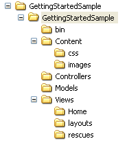
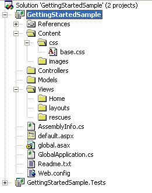
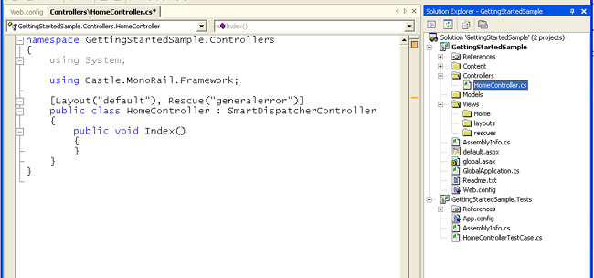
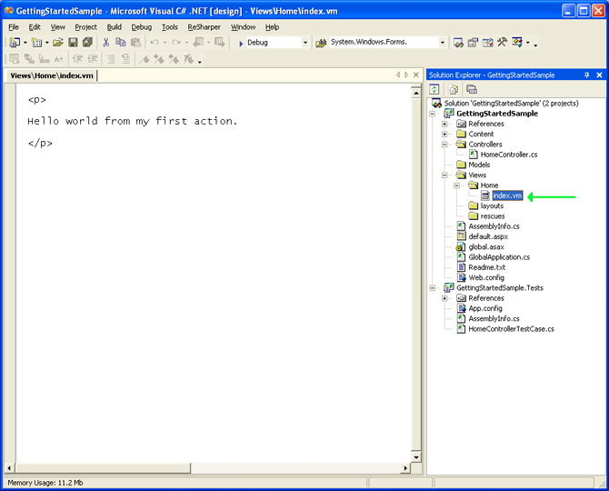
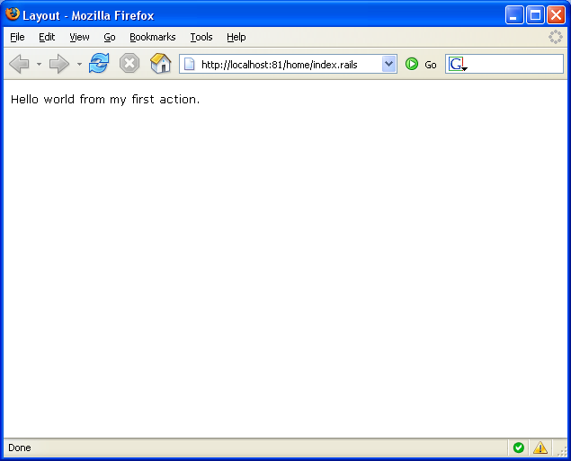
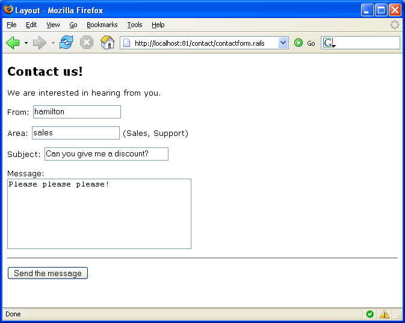
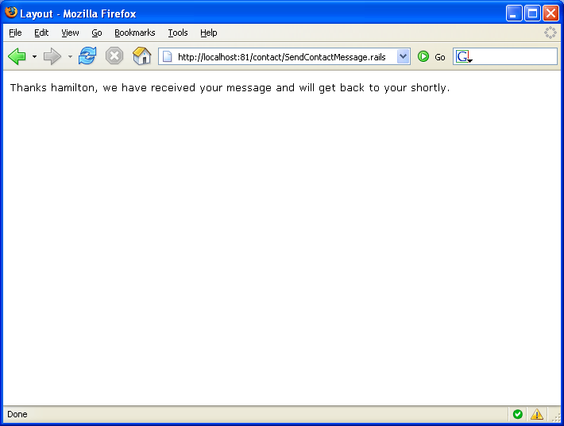

# Getting Started

Castle MonoRail greatly simplifies web development. The Getting Started chapter is going to show you how common tasks are handled and how MonoRail performs most of the repetitive work in web development on your behalf.

Among other things you will learn:

* About controllers and views and how they relate to each other
* How to use layouts and rescues
* How to use the `SmartDispatcherController` and the data binder
* How to easily create a CRUD page
* How Castle ActiveRecord integrates nicely with MonoRail

Although it should go without saying, you are not obliged to use ActiveRecord as your primary data access framework with MonoRail - you can use whatever approach to performing data access you like. That being said if you do use ActiveRecord, there are some provided integrations that might save you some time. Regardless, the framework provided allows you to develop similar integration for your preferred data access approach should you choose to do so.

## Requirements

Before beginning you will need a copy of the MonoRail binaries and dependencies on your local machine to use in your project; the latest versions can be obtained from the Castle [downloads page](http://www.castleproject.org/).

Also, during the course of this chapter will be using a database. For simplicity's sake all discussion surrounding database configuration will refer to MSSQL Server 2000 however if you prefer to use another database you can select any other database supported by NHibernate and will find very little deviation from the text in this chapter.

## Creating the Project Skeleton

As mentioned in the [Introduction](introduction.md), MonoRail tends to favour convention over configuration and when creating a project structure we encourage you to use a project structure similar to the following to remain in line with these conventions.



You are by no means _required_ to follow these conventions, however they will most likely made development easier for you in the long run. The following sections show you how to create this structure manually or by using the MonoRail project wizard and will further explain the reasoning behind its use.

### Create the project

Create an `ASP.NET Web Application` project in Visual Studio. Name the new project `GettingStartedSample` then click the OK button.

### Reference the MonoRail Assemblies

To make the new project into a MonoRail application you will need to add references to the MonoRail assemblies. For the purposes of our sample application the assemblies listed below will be required.

Assembly | Description
---------|------------
`Castle.MonoRail.Framework.dll` | Contains the classes that make up the core of the MonoRail framework.
`Castle.MonoRail.Framework.Views.NVelocity.dll` | Defines an NVelocity view engine plugin that will be used for handling views. This will in turn use the NVelocity rendering engine.
`Castle.Components.Validator.dll` | Provides a lightweight validation infrastructure created by Castle.
`Castle.Components.Binder.dll` | Contains the logic for the databinding that is used in MonoRail.
`Castle.Components.Common.EmailSender.dll` | Defines the interface for components that send email.
`Castle.Components.Common.EmailSender.SmtpEmailSender.dll` | Provides an SMTP implementation of the EmailSender that will be responsible for sending email.
`Castle.Core.dll` | Core Castle class library containing functionality used by many projects, including MonoRail.
`NVelocity.dll` | The NVelocity template engine used for rendering NVelocity templates.

### Create the Project Folders

The next step is to create the following folders on the project. Again, this is just a convention we encourage you to follow - you may come up with a more suitable convention for your projects after you get used to the framework so this is no way mandatory.



### Configuration

To configure the application additional information needs to be added to the web.config file; you must register the MonoRail configuration handler, the MonoRail configuration section, an HTTP handler and an HTTP module. Each of these will be discussed further below.

First, add the MonoRail configuration handler:

```xml
<configuration>
  <configSections>
    <section
      name="monorail"
      type="Castle.MonoRail.Framework.Configuration.MonoRailSectionHandler, Castle.MonoRail.Framework" />
  </configSections>
  ...
```

Next add the `<monorail>` configuration section:

```xml
  ...
  <monorail>
    <controllers>
      <assembly>GettingStartedSample</assembly>
    </controllers>
    <viewEngines viewPathRoot="Views">
      <add type="Castle.MonoRail.Framework.Views.NVelocity.NVelocityViewEngine, Castle.MonoRail.Framework.Views.NVelocity" />
    </viewEngines>
  </monorail>
  ...
```

This is the section that will contain all the configuration that controls setting up and customizing the behavior of MonoRail itself. The elements included for our sample above are the `<controllers>` node that defines the list of assemblies that contain the controllers for the application and the `<viewEngines>` node that specifies the view engine that will handle rendering the view templates in the application. There are more configuration options available in the Configuration chapter, however the elements above are sufficient for this sample.

It should be noted at this point that we have chosen the NVelocity view engine for rendering the views in our application. NVelocity is a very simple template engine that supports conditional statements, assignments, array creation, and iteration over collections that provides all the functionality you will generally need during the rendering of a view. You can learn more about NVelocity (and how we have improved it) on [its page](http://www.castleproject.org/others/nvelocity/index.html).

Next we will add a couple of HTTP Handlers under the `<httpHandlers>` node in the `<system.web>` section of the `web.config`.

```xml
  ...
  <system.web>
    <httpHandlers>
      <add
        verb="*"
        path="*.rails"
        type="Castle.MonoRail.Framework.MonoRailHttpHandlerFactory, Castle.MonoRail.Framework" />
      <add
        verb="*"
        path="*.vm"
        type="System.Web.HttpForbiddenHandler"/>
    </httpHandlers>
    ...
```

The first HTTP Handler is responsible for routing incoming requests to MonoRail based on their extension. The example above indicates that incoming requests ending in .rails should be handled by MonoRail. If you prefer another extension such as .castle you can simply change the value of the path attribute to your preferred value.

The second handler is present as a security consideration. It is important to be aware that if a file in a web folder is accessed from the outside world its contents will normally be sent directly to the calling browser. To prevent the source for your view files from being visible to the outside world an `HttpForbiddenHandler` needs to be configured for the file extension of any files you don't want want to be directly accessible. In this case, because we chose to use the NVelocity view engine and our view templates use the `.vm` extension this is the extension we have associated with the `HttpForbiddenHandler`.

Finally you need to register the MonoRail HTTP module that handles incoming requests into the `<httpModules>` node, which is also found in the `<system.web>` section:

```xml
    ...
    <httpModules>
      <add
        name="monorail"
        type="Castle.MonoRail.Framework.EngineContextModule, Castle.MonoRail.Framework" />
    </httpModules>
  </system.web>
</configuration>
```

That's it - the configuration is now complete. Next we will start exploring controllers, actions and views.

### Controllers, Actions and Views

For all MonoRail MVC applications the entry point for each request is the controller - this is the single largest deviation from the approach taken in Web Forms development where the entry point is the page itself. With MonoRail the controller is executed in response to a request where an action decides whether or not it should render a view and, if so, which one to render. As a result the controller has control over the application flow rather than the pages/views. This returns views to their original role: to present information - nothing more and nothing less.

It is important at this point to understand the relationship between the structure of the MonoRail URL and how it relates to the controller and the method to execute on the controller. A common URL to a MonoRail web page might look like the following:
`http://www.some-server.net/home/index.rails`

```
http://www.some-server.net/home/index.rails
|                         |    |     |     |
+-------------------------+----+-----+-----+
          ^                 ^     ^     ^
          |                 |     |     |
        Server              |     |     |
                            |     |     |
                      Controller  |     |
                                  |     |
                               Action   |
                                        |
                                    Extension
```

In the diagram above the extension `.rails` indicates that MonoRail should handle the request, `home` specifies the controller to use and `index` indicates that the `Index` action method on the controller should be executed. Since MonoRail prefers convention over configuration the default behaviour is for MonoRail to use the controller name in the URL to locate the controller class by appending the word ''Controller'' to the end, so in the event that the controller name `home` is found in the URL the controller class used in response to this request will be the `HomeController` class.

### Your First Controller

It is now time to create your first controller. If you have used the wizard to create the project, a `HomeController` class will already have been created for you. If it is not already present you should create a new class named `HomeController` in the Controllers folder of your project.



Inside the `HomeController` class the following code should be present. If you have just created the class file yourself you should add the code now.

```csharp
namespace GettingStartedSample.Controllers
{
    using System;
    using Castle.MonoRail.Framework;

    [Layout("default"), Rescue("generalerror")]
    public class HomeController : SmartDispatcherController
    {
        public void Index()
        {
        }
    }
}
```

This is a pretty basic sample for the moment. Don't worry if you don't understand it at this point; we'll explain the code and surrounding concepts in more detail in the next section.

### The Index Action and View

An _action_ is a public non-static method exposed by a controller class. The controller shown in the previous section exposes just one action, `Index` which is empty, however due to MonoRail's convention over configuration approach the controller will render a specific view template by default.

The view template chosen by MonoRail is affected by the view engine chosen during the configuration phase of the project. Since we chose to use the NVelocity view engine all of our view templates will end with the `.vm` extension.

By default, the specific view template file chosen for rendering is based on the name of the action being executed and the folder in which the view template is located is based on the name of the controller handling the request. As a result the default view template chosen by the `Index` action on the `HomeController` will be `index.vm` located under the `/views/home` folder in the project.

**Overriding behavior:** This behavior can be overridden in several ways that are covered later in this guide.

If the view template `index.vm` does not yet exist in the `/views/home` folder of your project you should create it now.



To illustrate a point we will make the content of the `home.vm` file nice and simple to start with. If the `home.vm` file does not contain the content below just copy and paste it in there.

```html
<p>
  Hello world from my first action.
</p>
```

**Editing .vm files:** You can make Visual Studio use the HTML editor for .vm files. Use the Open With... option from the context menu.

This is a fairly simple view; note that in the template we did not include the html or body tags. This is because we will leave those to the layout to render, which we will cover next.

### Setting the Layout and Rescue

When we created the `HomeController` you may have noticed the `Layout` and `Rescue` attributes were specified on the class.

```csharp
[Layout("default"), Rescue("generalerror")]
public class HomeController : SmartDispatcherController
```

These attributes define the following:

* The `Layout` attribute indicates that every view rendered by this controller to should be wrapped in the content from the `default.vm` template in the `/layouts` folder of the project.
* The `Rescue` attribute tells MonoRail that if any unhandled exception is thrown by an action on the `HomeController` a special _rescue_ view template called `generalerror.vm` in the `/rescues` folder of the project should be rendered.

Layouts and rescues can minimize the amount of work you do when building view templates and allow your view templates to be better encapsulated.

### Creating the Layout

A _layout_ defines the outer content of a rendered view and has some similarities to a master page. Your project can have as many layouts as you like - the layout files simply need to be placed into the /layouts folder of the project.

Our first layout is very simple, and should be saved as `default.vm` on the `/layouts` folder.

```html
<!DOCTYPE html PUBLIC "-//W3C//DTD XHTML 1.1//EN" "http://www.w3.org/TR/xhtml11/DTD/xhtml11.dtd">
<html>
  <head>
    <meta http-equiv="Content-Type" content="text/html; charset=iso-8859-1" />
    <title>Layout</title>
    <link rel="stylesheet" href="$siteRoot/Content/css/base.css" />
  </head>
  <body>

    $childContent

  </body>
</html>
```

At this point some explanation of the template above is in order.

The `$childContent` variable defines where the content of the view being rendered will be included on the layout.

The `$siteRoot` variable will represent the root of the application. If, for example, the web application is using a virtual directory it will be the name of the virtual directory. Under normal circumstances, however, it will simply evaluate to `/`.

### Seeing the Results

If you created the application with the wizard, just hit Debug &raquo; Start or F5 in Visual Studio to start a debug session. On the browser, go to the application URL and enter the controller name and the action name plus the extension you have selected, e.g. `http://localhost:8081/home/index.rails`. The browser should render the view content with the layout applied:



If you view the source of the page in your browser you should see well formed XHTML content that includes the content defined in the layout as well as the content rendered by the view.

**Using IIS:** Should you wish to run the application using Microsoft Internet Information Services, you must associate the extension you selected (i.e. `.rails`) with the ASP.Net ISAPI. For more information on how to do this please see the chapter entitled Installation.

### Passing Values to a View

As shown by the excessively simple view example used earlier, views are pretty useless unless you can pass custom values to them for rendering at runtime. The main mechanism for transferring values from the controller to the view is the `PropertyBag`. Values placed in the `PropertyBag` will be made available to the view template. However, each view engine will provide access to these values differently.

Since we're using the NVelocity view engine the values in the `PropertyBag` will be exposed as NVelocity variables which begin with a `$` symbol in the NVelocity view template.

To demonstrate this principle let's create another action on our `HomeController`:

```csharp
[Layout("default"), Rescue("generalerror")]
public class HomeController : SmartDispatcherController
{
    public void Index()
    {
    }

    public void DataToTheView()
    {
        PropertyBag["name"] = "John Doe";
        PropertyBag["today"] = DateTime.Now;

        RenderView("data");
    }
}
```

The new `DataToTheView` action uses the `PropertyBag` to pass data to the view. It then invokes the built-in `RenderView` method on the controller to specify that the `/views/home/data.vm` view template should be rendered instead of the default `/views/home/datatotheview.vm` template.

Now let's create the `data.vm` template in the `\views\home` folder:

```html
<h3> Hello $name! </h3>

<h4> Today is $today.ToShortDateString() </h4>
```

To see the result of the change run the application and visit `home/datatotheview.rails` in your browser.

### Creating a Rescue

In an earlier step we specified that our controller uses a rescue. A rescue is a special purpose view template that will be rendered only in the event that an exception is thrown while executing an action on a controller. Lets create the rescue view to report errors nicely and see how it works.

First, create a view template named `generalerror.vm` in the `\views\rescues` folder with the following content.

```
#macro(showexception $exc)
<b>$exc.GetType().Name</b>

Message:
$exc.Message

#if($exc.StackTrace)
StackTrace:
$exc.StackTrace
#end

#if($exc.InnerException)
<b>Inner exception:</b>
#set($inner = $exc.InnerException)
#showexception($inner)
#end
#end

<h2>Unexpected error happened</h3>

<p> This is the rescue page. See the exception details below </p>

<pre>
#set($exception = $context.LastException)
#showexception($exception)
</pre>
```

There's quite a bit of logic in this template, but we won't get into the details now. If you want to explore these features in more detail see the NVelocity documentation.

Now let's create a new action that will throw an exception so we can see the rescue template in action:

```csharp
[Layout("default"), Rescue("generalerror")]
public class HomeController : SmartDispatcherController
{
    public void Index()
    {
    }

    public void ErroneousAction()
    {
        throw new Exception("I'm a bad bad action.");
    }

    public void DataToTheView()
    {
        PropertyBag["name"] = "John Doe";
        PropertyBag["today"] = DateTime.Now;
        RenderView("data");
    }
}
```

If you now run the application and go to `home/erroneousaction.rails` in your browser the `ErroneousAction` method will throw an exception as we specified and the rescue will be displayed.

## Data Binding

Although the controller we've been using so far in our sample application extends from `SmartDispatcherController` we haven't yet used any of its more advanced capabilities. The SmartDispatcherController base class, as the name implies, provides some "smart" functionality, including binding query string values, form values and even cookies to the parameters of action methods when they are invoked. This includes both simple types and custom, complex types as will be discussed in the following sections.

### Simple Parameters

Simple types can be bound to action parameters with no special configuration other than to ensure your controller is derived from the SmartDispatchController class. For example, suppose you have the following HTML form on a view:

```html
<form action="/home/saveinformation.castle" method="post">
  <input type="text" name="name" value="John doe" />
  <input type="text" name="age" value="30" />
  <input type="text" name="dob" value="07-16-1979" />
  <input type="submit" value="Send" />
</form>
```

The form action directs the post to the `HomeController` class' `SaveInformation` action method. This method can be constructed in such a way that it will expect the values from the submitted HTML form as parameters:

```csharp
public class HomeController : SmartDispatcherController
{
    public void Index()
    {
    }

    public void SaveInformation(String name, int age, DateTime dob)
    {
        // work work work

        // Send the user back to the index
        RedirectToAction("index");
    }
}
```

In the above example each of the form fields will be data-bound to the method parameter of the same name on the `SaveInformation` method.

Using this automatic data binding feature reduces the effort required to access the values submitted by the view. It is still possible to access the values from the HTML form without data binding through use of the `Params` or `Form` name-value collections exposed by the controller, however using data binding is cleaner and simpler. The code sample below provides the same functionality as the example above - we will leave it to you to decide which is clearer and easier to use.

```csharp
public class HomeController : SmartDispatcherController
{
    public void Index()
    {
    }

    public void SaveInformation()
    {
        string name = Params["name"];
        int age = Convert.ToInt32(Params["age"]);
        DateTime dob = Convert.ToDateTime(Params["dob"]);

        // work work work

        // Send the user back to the index
        RedirectToAction("index");
    }
}
```

The `SmartDispatchController` is capable of handling a wide range of built-in .NET types. For further details on the types supported refer to the documentation on Data Binding in the Controllers chapter.

### Complex Objects

Along with data binding simple value types the `SmartDispatcherController` provides features to data bind custom and arbitrarily complex objects. In order to illustrate how this can be achieved we will create a new controller that presents a contact form designed to allow a user to contact a department in a fictitious company.

First, create a new controller named `ContactController` and add two empty actions; `ContactForm` and `SendContactMessage`:

```csharp
namespace GettingStartedSample.Controllers
{
    using System;
    using Castle.MonoRail.Framework;

    [Layout("default"), Rescue("generalerror")]
    public class ContactController : SmartDispatcherController
    {
        public void ContactForm()
        {
        }

        public void SendContactMessage()
        {
        }
    }
}
```

Next, in the `/models` folder create a class named `Contact` - this class will be used to represent the contact information submitted by the user.

```csharp
public class Contact
{
    private string from;
    private string area;
    private string subject;
    private string message;

    public string From
    {
        get { return from; }
        set { from = value; }
    }

    public string Area
    {
        get { return area; }
        set { area = value; }
    }

    public string Subject
    {
        get { return subject; }
        set { subject = value; }
    }

    public string Message
    {
        get { return message; }
        set { message = value; }
    }
}
```

Now create the view to be displayed by the `ContactForm` action. The template file `contactform.vm` should be created in the `\views\contact` folder and must contain the following code:

```html
<h2>Contact us!</h2>

<p>
We are interested in hearing from you.
</p>

<form action="contact/sendcontactmessage.castle" method="post">

<p>
From: $FormHelper.TextField("contact.from")
</p>

<p>
Area: $FormHelper.TextField("contact.area") (Sales, Support)
</p>

<p>
Subject: $FormHelper.TextField("contact.subject", "%{size='30'}")
</p>

<p>
Message: <br/>
$FormHelper.TextArea("contact.message", "%{cols='35', rows='6'}")
</p>

<br />

<p>
<input type="submit" value="Send the message" />
</p>

</form>
```

In the code above we have made use of the FormHelper helper class to generate an HTML form with the following source:

```html
<h2>Contact us!</h2>

<p>
We are interested in hearing from you.
</p>

<form action="contact/sendcontactmessage.castle" method="post">

<p>
From: <input type="text" name="contact.from" />
</p>

<p>
Area: <input type="text" name="contact.area" /> (Sales, Support)
</p>

<p>
Subject: <input type="text" name="contact.subject" size="30" />
</p>

<p>
Message: <br/>
<input type="textarea" name="contact.message" cols="35" rows="6" />
</p>

<br />

<p>
<input type="submit" value="Send the message" />
</p>

</form>
```

**Further FormHelper information:** Further information on the `FormHelper` helper and on helpers in general can be found in the chapter entitled Helpers.

At this point it is important to note that the name of each generated field on the HTML form has been prefixed with the text `contact` followed by a dot and then the name of the property of the form (eg. `contact.from` in the case of the "`From`" field in our example). This indicates that each of the fields belong to a single group of data that will be bound to an object by the data binder.

Finally, change the parameters of the `SendContactMessage` action on the `ContactController` to indicate to the MonoRail binder that it should bind the form data prefixed with `contact` to the `Contact` class created earlier:

```csharp
public void SendContactMessage([DataBind("contact")] Contact theContact)
{
    // Pretend to save the contact ...

    // ..work work work..

    // Now lets add the contact to the property bag
    // so we can render a nice message back to the user

    PropertyBag["contact"] = theContact;

    RenderView("confirmation");
}
```

As you can see, a parameter named `theContact` has been added to the `SendContactMethod` action which has been decorated with the `DataBindAttribute`. The `DataBindAttribute` has been initialized with a string parameter that tells the binder that it should attempt bind the form values prefixed with "`contact.`" to the properties of the `theContact` parameter that share the same name as the part of the form element name that appears after the text "`contact.`".

While we're here we might as well create the confirmation view as well:

```html
<p>
Thanks $!contact.from, we have received your message and will
get back to your shortly.
</p>
```

Now if you visit `/contact/contactform.castle` in your browser you should be able to view the results of your work. Fill the form elements, submit it and you should see the name you submitted in the from field on the form.





## See Also

### Integrating with ActiveRecord

In addition to this getting started guide you may want to look at [Getting Started with ActiveRecord Integration](getting-started-with-activerecord-integration.md) for a slightly more advanced getting started topic introducing data persistence with [ActiveRecord](https://github.com/castleproject/ActiveRecord).