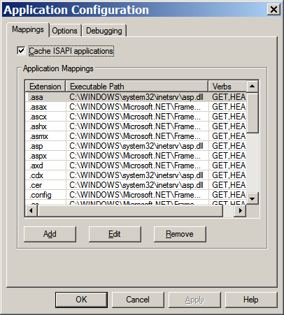

# Installation

MonoRail can be installed into many different environments; the following section details the actions to be undertaken in some of those environments.

## Running under IIS

If you are running IIS, then you will need to associate the extension used in the incoming request with MonoRail using ASP.NET ISAPI.

### Finding the URL Extension

The extension associated with MonoRail is configured in your '''web.config''' and is selected when the application is configured. Look for the httpHandler whose type is `Castle.MonoRail.Framework.MonoRailHttpHandlerFactory`; the extension associated with MonoRail is specified in its `path` attribute.

```xml
<httpHandlers>
  <add verb="*" path="*.rails"
    type="Castle.MonoRail.Framework.MonoRailHttpHandlerFactory, Castle.MonoRail.Framework" />
</httpHandlers>
```

While this value will often be .castle or .rails it can be anything you choose, so check your web.config to be sure.

### Configuring IIS

To set up the ISAPI association please use the following procedure:

* Open the IIS MMC

    

* Right-click the target website item (e.g. `Default Web Site`), choose `Properties` then select the `Home Directory` tab of the resulting dialog.

    

* Click the `Configuration` button to view the list of application mappings for the site.

    

* Click the `Add` button to add a new application mapping.

    

* Fill out the Add/Edit Application Mapping dialog:
  1. Enter the full path to the ASP.NET ISAPI DLL (`aspnet_isapi.dll`) into the `Executable` field.
  1. Enter the URL extension determined earlier into the `Extension` field (e.g. `.rails`).  Ensure that you include the leading dot.
  1. Uncheck the `Check file exists` check box.

**Finding the ISAPI DLL:** You can either browse for the file using the `Browse` button or you can copy-and-paste the complete DLL file name from another pre-existing mapping, such as `.aspx` mapping.

In most systems the path will be something like `C:\WINDOWS\Microsoft.NET\Framework\v1.1.4322\aspnet_isapi.dll` (for .NET 1.1) or `C:\WINDOWS\Microsoft.NET\Framework\v2.0.50727\aspnet_isapi.dll` (for .NET 2.0).

* Click the `OK` button to save the new application mapping, then click `OK` to close the `Application Configuration` dialog and click `OK` one more time to close the website properties dialog.

**Windows XP Pro users:** If your OK button is disabled even if you have Administrator rights it may be because the `Executable` field contains a relative path.  To correct this try clicking in the `Executable` field which will expand the relative path to the dll into a full path and will enable the OK button.

## Using Cassini

[Cassini](http://www.asp.net/Projects/Cassini/Download/Default.aspx?tabindex=0&tabid=1) is the easiest way to run the application as it requires nothing to be configured. It is suitable for development. You can run it from VS.Net and then be able to debug your application easily.


If you are using Visual Studio 2005 or 2008, then you might want to use the integrated web server as it is basically the same.

## Mono with XSP

Open a shell and go to directory containing web.config. Call xsp:

```
xsp --port 80
```

Notice that Apache2 + mod_mono is much more efficient than XSP. Use XSP only for tests and small applications development.

## Mono with Apache

We assume that you have `Apache Httpd`, `mod_mono` and `xsp` from the Mono Project installed.

### Configuration

Add the following lines to your `httpd.conf`:

```
LoadModule mono_module modules/mod_mono.so
AddHandler mono .rails .aspx .ashx .asmx .ascx .asax .config .ascx
MonoRunXSP True

Alias /test "/web/test"
AddMonoApplications default "/test:/web/test"
<Location /test>
	SetHandler mono
</Location>
```

The first line adds the `mod_mono` module to Apache. The second line sets up `mod_mono` to handle asp.net and MonoRail file extensions. The third line allows Apache to start and stop the `mod_mono_server` process. The following group of lines sets up `/test` to map to your application.

### Apache Httpd2

If you build `mod_mono` from sources, file `mod_mono.conf` will be installed at `/etc/apache2/mod_mono.conf`. To load the module you only need to create a symlink and reload Apache:

```
ln -s /etc/apache2/mond_mono.conf /etc/apache2/mods-enabled/
```

Place the configuration above on `/etc/apache2/sites-enabled/default` and change "`Location`" for "`Directory`" if your website lives in filesystem ([see here](http://httpd.apache.org/docs/2.2/mod/core.html#location)). `/etc/apache2/sites-enabled/default`:

```
AddHandler mono .rails .aspx .ashx .asmx .ascx .asax .config .ascx
Alias /example /var/www/example
AddMonoApplications default "/example:/var/www/example"
MonoRunXSP True
<Directory /var/www/example>
	SetHandler mono
</Directory>
```

Paths could change depending of your distribution

### Application Deployment

To deploy, simply copy your webapp's `bin` and `Views` directory as well as `Global.asax` and your `web.config` files to `/web/test` and then start Apache.

You can now point your browser at `http://yourserver.com/test/index.rails` or which ever `.rails` page you choose.

## Deploying to a Shared Host

On a shared hosting, you may not be able to convince the host to map `.rails` extensions to the ASP.NET framework, which means that you wouldn't be able to "catch" a request for a rails document and map it to the appropriate controller.

A simple solution for this problem is to just switch to `.aspx` extension (and change the `httpHandler` configuration, of course). For example:

```xml
<httpHandlers>
  <add verb="*" path="*.ashx"
    type="Castle.MonoRail.Framework.MonoRailHttpHandlerFactory, Castle.MonoRail.Framework" />
</httpHandlers>
```