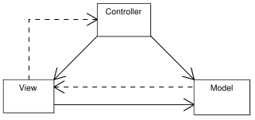
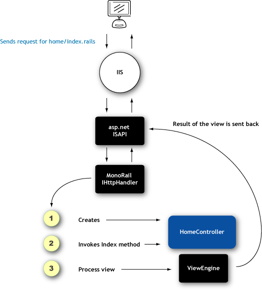

# Introduction

[MonoRail](http://www.castleproject.org/monorail/) is a fully MVC compliant web framework inspired by [ActionPack](http://ap.rubyonrails.org/).

MonoRail differs from the standard [WebForms](http://msdn.microsoft.com/en-us/library/ms973868.aspx) approach to development as it enforces separation of concerns; controllers simply handle application flow, models represent the data, and the view is only concerned with the logic surrounding the presentation of that data. Consequently, you write less code and end up with a more maintainable application.

## Background

Before diving into the details of MonoRail it's probably worth understanding a little more about what it is, what value it brings to web development and how it works. Further information on each of these topics is covered in the following sections.

### What is MVC

Model-View-Controller (MVC) is an architectural pattern used in software engineering. In complex computer applications that present a large amount of data to the user, a developer often wishes to separate the logic concerning data (otherwise known as the model) and the user interface (or view) so that changes to the user interface will not affect data handling, and that the data can be reorganized without changing the user interface. The model-view-controller pattern solves this problem by decoupling data access and business logic from data presentation and user interaction through the introduction of an intermediate component: the controller.

#### Model

The model in the MVC pattern is the domain-specific representation of the information on which the application operates. Domain logic adds meaning to raw data (e.g., calculating if today is the user's birthday, or the totals, taxes, and shipping charges for shopping cart items). Many applications use a persistent storage mechanism (such as a database) to store data. MVC does not specifically mention the data access layer because it is understood to be underneath or encapsulated by the Model.

#### View

The view renders the model into a form suitable for interaction, typically a user interface element. Multiple views can exist for a single model for different purposes.

#### Controller

The controller is responsible for processing and responding to events, typically user actions, and may invoke changes on the model.

## Why use MonoRail

MonoRail differs from the standard [WebForms](http://msdn.microsoft.com/en-us/library/ms973868.aspx) approach to development as it enforces separation of concerns; controllers simply handle application flow, models represent the data, and the view is only concerned with the logic surrounding the presentation of that data. Consequently, you write less code and end up with a more maintainable application.

Although MonoRail can use WebForms as a view engine, it does not work as smoothly as others engines. If your project depends too much on third party Web controls or if you IT team skill set is totally centered around WebForms, MonoRail would not be a good choice. Because MonoRail does not provide abstractions over the page processing like WebForms, there is an additional learning curve for developers that were introduced to web development using pure WebForms without knowledge of the HTTP protocol.

Following are some other benefits of using the MonoRail framework.

### Convention Over Configuration

Like RoR, MonoRail prefers convention over configuration. The project structure skeleton is the same throughout all MonoRail enabled solutions. The MonoRail installer also includes a handy templated solution provider for both VS.NET 2003 and 2005 to create the project skeleton and testing is included. Accustomed MonoRail developers can open any solution and just know where things are going to be.

### Container support

MonoRail supports IoC ([Inversion of Control](http://en.wikipedia.org/wiki/Inversion_of_control)) via the [Castle Windsor](https://github.com/castleproject/Windsor) container. Controllers and their dependencies/parameters can be injected by the container if necessary.

### Testability

Controllers are testable classes sitting outside of the usual ASP.NET cruft. There are a number of framework features within MonoRail which specifically aid testing.

## How it works

MonoRail is essentially a front controller sitting over the ASP.NET infrastructure intercepting specially formed URI's. This is achieved through the provision of an alternate implementation of the IHttpHandler interface that extracts information from the Url and searches for a controller in a binary tree. If found, the controller is created and from that point on, the controller handles the request.

The controller is able to select the action (method) to invoke, process the arguments (in the case of `SmartDispatcherController`) and delegate the execution to it.

When the action returns, the controller checks if a view was selected (and no redirect was issued). If so the ViewEngine is invoked to process the selected view, which renders the content directly to the client's browser.

As MonoRail runs on top of ASP.NET infrastructure (not to be confused with WebForms) it takes advantage of all features like Session management, Application/Request level events and security.

## Support

Castle Stronghold, which sponsors the project and was started by Castle Project's founder can provide commercial support for MonoRail, however the community surrounding MonoRail also provides excellent support through the Castle forums and mailing lists.