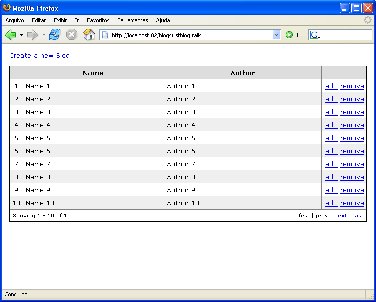
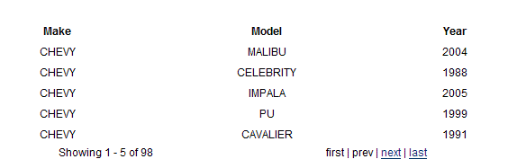

# PaginationHelper

The PaginationHelper simplifies the creation of paginated navigation on items.

## Standard Paging

Suppose you have a set with 400 items:

```csharp
public class MyController : SmartDispatcherController
{
	public void List()
	{
		PropertyBag["items"] = ObtainMyLargeCollection();
	}

	private IList ObtainMyLargeCollection()
	{
		...
	}
}
```

With the `PaginationHelper` you can return a sliced representation of the collection:

```csharp
public class MyController : SmartDispatcherController
{
    public void List()
    {
        PropertyBag["items"] = PaginationHelper.CreatePagination( ObtainMyLargeCollection(), 10 );
    }

    private IList ObtainMyLargeCollection()
    {
        ...
    }
}
```

The helper will look for a `page` on `Request.Params` to define its starting index. The `CreatePagination` method returns a `IPaginatedPage` object which exposes several properties so you can build a nice pagination box:

* `FirstIndex`
* `CurrentIndex`
* `LastIndex`
* `PreviousIndex`
* `NextIndex`
* `HasPrevious`
* `HasNext`
* `HasFirst`
* `HasLast`
* `FirstItem`
* `LastItem`
* `TotalItem`

This a snippet that renders the items and the pagination box:

```
#foreach($row in $items)
  <tr>
    <td>$row.Name</td>
    <td>$row.Email</td>
  </tr>
#end</table>

<div class="pagination">
<table width="100%" border="0">
  <tr>
  <td>Showing $items.FirstItem - $items.LastItem of $items.TotalItems</td>
  <td align="right">
#if($items.HasFirst) $PaginationHelper.CreatePageLink( 1, "first" ) #end
#if(!$items.HasFirst) first #end
#if($items.HasPrevious) | $PaginationHelper.CreatePageLink( $items.PreviousIndex, "prev" ) #end
#if(!$items.HasPrevious) | prev #end
#if($items.HasNext) | $PaginationHelper.CreatePageLink( $items.NextIndex, "next" ) #end
#if(!$items.HasNext) | next #end
#if($items.HasLast) | $PaginationHelper.CreatePageLink( $items.LastIndex, "last" ) #end
#if(!$items.HasLast) | last #end
  </td>
  </tr>
</table>
</div>
```

This will result in something like the following:



## Cached Paging

The `PaginationHelper` has a cached version of its functionality. That allows the data source to be loaded and reused for a limited period of time. The cachekey must be carefully defined with the application semantics in mind. A bad cachekey might allow the data source to be shared by request from different users and with different data source search criterias (when the data source is the result of a search)

Suppose you have a form with many search criterias:


Your view will look something similar to this, and make sure to POST rather than GET:

```html
<form id="search" method="post" action="$siteRoot/Cars/Search.aspx">
  <input id="make" type="text" size="14" name="make" /><br />
  <input id="model" type="text" size="14" name="model" /><br />
  <input id="year" type="text" size="14" name="year" /><br />
  <input type="Submit" class="button" value="Search!" />
</form>
```

The pagination helper exposes a delegate that you will need to grab your search results. Pass it your method that handles the actual searching. Here is an example controller:

```csharp
public class CarController : SmartDispatcherController
{
	private String make, model, year;

	public IList PerformSearch()
	{
		// Do your actual search

		return Car.FindByMakeModelYear(make, model, year);
	}

	public void Search(String make, String model, String year)
	{
		// create the pagination

		PropertyBag["Cars"] = PaginationHelper.CreateCachedPagination(
			"carssearchkey" + this.make + this.model + this.year,
			5, new 	DataObtentionDelegate(PerformSearch));
	}
}
```

Our resulting view, it is important that we expose our criteria to the view so the next/first/last/prev links can be correctly constructed and work properly:

```
<table cellpadding="4">
	<tr>
		<th>Make</th>
		<th>Model</th>
		<th>Year</th>
	</tr>
#foreach($Car in $Cars)
	<tr>
		<td>$!Car.Make</td>
		<td>$!Car.Model</td>
		<td>$!Car.Year</td>
	</tr>
#end
</table>
<div class="pagination" id="pagination">
<table width="90%" border="0">
	<tr>
		<td>Showing $Cars.FirstItem - $Cars.LastItem of $Cars.TotalItems</td>
		<td align="right">
		#if($Cars.HasFirst)
			$PaginationHelper.CreatePageLink( 1, "first",null, "%{make=$make, model=$model,year=$year}" )
		#else
			first
		#end
		#if($Cars.HasPrevious)
			| $PaginationHelper.CreatePageLink( $Cars.PreviousIndex, "prev",null, "%{make=$make,model=$model,year=$year}" )
		#else
			| prev
		#end
		#if($Cars.HasNext)
			| $PaginationHelper.CreatePageLink( $Cars.NextIndex, "next",null, "%{make=$make,model=$model,year=$year}" )
		#else
			| next
		#end
		#if($Cars.HasLast)
			| $PaginationHelper.CreatePageLink( $Cars.LastIndex, "last",null, "%{make=$make,model=$model,year=$year}" )
		#else
			| last
		#end
		</td>
	</tr>
</table>
</div> <!-- end pagination -->
```

And how it looks:

