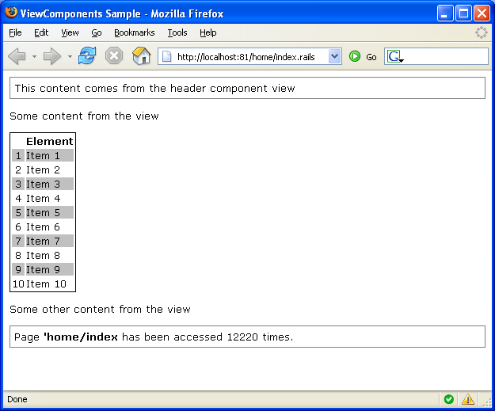

# View Components

It is very common to have a portion of UI content that is reused amongst pages. When the content is more than simple static content you can rely on the ViewComponent infrastructure.

A `ViewComponent` is a class that resembles the controller functionality. It might use views and send data to the view. It also supports inner sections and parameters.

## Built-In View Components

MonoRail comes with a collection of built in view components:

* [CaptureFor](capturefor.md)
* [SecurityComponent](securitycomponent.md)
* [DiggStylePagination](diggstylepagination.md)
* ColumnRenderer
* AuthenticatedContent
* ChildContentComponent
* UpdatePage and UpdatePageTag

## Creating a View Component

A ViewComponent is a class that extends the `ViewComponent` abstract class. Three methods can be optionally overriden to customize its behavior:

* `Render`: selects the view or uses another approach to render the component content
* `Initialize`: used to intialize the state of your view component, usually by examining supplied parameters
* `SupportsSection`: invoked by the view engine to check if the component supports the section supplied on the view

Note that starting with v1RC3, much of the work normally handled in the `Initialize` and `SupportsSection` methods is now done using attributes, so it should be rare to need those methods.

A very minimal ViewComponent could be the following:

```csharp
using Castle.MonoRail.Framework;

public class HeaderComponent : ViewComponent
{
}
```

The ViewComponent above will fallback to the default behavior as nothing was customized. The default behavior is to render the view associated with the component, which should lie on the folder `components/headercomponent/default`. For example, if you were using NVelocity view engine it would be `$siteRoot/Views/components/headercomponent/default.vm`.

Just like controllers, you can select different views. For example:

```csharp
using Castle.MonoRail.Framework;

public class HeaderComponent : ViewComponent
{
    public override void Render()
    {
        RenderView("otherview");
    }
}
```

For the case above the selected view would be `components/headercomponent/otherview.vm` (in the case of NVelocity view engine).

Similarly, if all the HTML rendering is handled in code, then you can choose to use no view at all:

```csharp
using Castle.MonoRail.Framework;

public class HeaderComponent : ViewComponent
{
    public override void Render()
    {
        /* .... */
        CancelView();
    }
}
```

## Using View Components

A ViewComponent has no relation with controller, only with the views selected by the controllers.

When it comes to usage, ViewComponents can be used with a block (nested content) or without (inline). The name of the component (class name) is used to identify the ViewComponent you want to render. Usage varies depending on the View Engine implementation.

```
#component(HeaderComponent)
```

ViewComponents that use the nested content usually use a different syntax:

```
#blockcomponent(NewsComponent)
<ul>
#foreach($new in $news)
  <li>$news.Date $news.Title</li>
#end
</ul>
#end
```

## Passing Parameters

The programmer can supply parameters to the ViewComponent.

On the view side, parameters are supplied in different ways, depending on your view engine of choice:

```
#blockcomponent(TableComponent with "elements=$items" "border=0" "style=border: 1px solid black;" "cellpadding=0" "cellspacing=2")
...
#end
```

In the ViewComponent's code, parameters can be accessed using the property `ComponentParams`. For example:

```csharp
using Castle.MonoRail.Framework;

public class TableComponent : ViewComponent
{
    private ICollection elements;

    private object border;
    private string style;
    private object cellpadding;
    private object cellspacing;

    public override void Initialize()
    {
        elements = (ICollection) ComponentParams["elements"];

        border = ComponentParams["border"];
        style = (String) ComponentParams["style"];
        cellpadding = ComponentParams["cellpadding"];
        cellspacing = ComponentParams["cellspacing"];

        base.Initialize();
    }
    ...
```

`ViewComponentParamAttribute`

```csharp
using Castle.MonoRail.Framework;

public class TableComponent : ViewComponent
{
    [ViewComponentParam("elements", Required=true)]
    public ICollection elements { get; set; }

    [ViewComponentParam]
    public object border { get; set; }

    [ViewComponentParam]
    public string style { get; set; }

    [ViewComponentParam]
    public object cellpadding { get; set; }

    [ViewComponentParam]
    public object cellspacing { get; set; }

    public override void Initialize()
    {
        base.Initialize();
    }
    ...
```

The `ViewComponentParamAttribute` will automatically bind the parameter to the property. The attribute will only bind to public properties. (Note that the C# v3/VS2008 syntax is used above for the properties. For VS2005 and earlier, the getters and setters would need fully implemented bodies.)

`ViewComponentParamAttribute` binds the parameter with the given name to the property. If no name is given in the `ViewComponentParamAttribute`, then it binds the parameter with the same name as the property.

## Block and Nested Sections

The inner content block is the content that is enclosed by a ViewComponent used as a block. For example:

```
#blockcomponent(RepeatComponent)

This is the inner content
$counter

#end
```

The ViewComponent has control over the nested content and can renders it how many times it wants to. The following component renders the inner content five times:

```csharp
using Castle.MonoRail.Framework;

public class RepeatComponent : ViewComponent
{
    public override void Render()
    {
        for (int i = 0; i < 5; i++)
        {
            PropertyBag["counter"] = i;
            Context.RenderBody();
        }
    }
}
```

Often this is not enough to create a reusable ViewComponent. For these cases you can have inner sections with your view component. The ViewComponent's code can have a more elaborated logic to render the section contents. For example:

```
#blockcomponent(TableComponent with "elements=$items")
#colheaders
<tr>
  <th>&nbsp;</th>
  <th>Element</th>
</tr>
#end

#item
<tr>
  <td>$index</td>
  <td>$item</td>
</tr>
#end

#altitem
<tr>
  <td align="center">$index</td>
  <td>$item</td>
</tr>
#end
#end
```

In the example above there are three distinct inner sections: `colheaders`, `item` and `altitem`. The `TableComponent` renders a simple table and is defined in the following code:

```csharp
using Castle.MonoRail.Framework;

[ViewComponentDetails("Table"), Sections="colheaders,item,altitem")]
public class TableComponent : ViewComponent
{
    [ViewComponentParam("elements", Required=true)]
    public ICollection elements { get; set; }

    [ViewComponentParam]
    public object border { get; set; }

    [ViewComponentParam]
    public string style { get; set; }

    [ViewComponentParam]
    public object cellpadding { get; set; }

    [ViewComponentParam]
    public object cellspacing { get; set; }

    public override void Render()
    {
        RenderText(
        string.Format("<table border=\"{0}\" style=\"{1}\" cellpadding=\"{2}\" cellspacing=\"{3}\">",
                      border, style, cellpadding, cellspacing));

        if (Context.HasSection("colheaders"))
        {
            Context.RenderSection("colheaders");
        }

        if (elements != null)
        {
            int index = 0;

            foreach(object item in elements)
            {
                PropertyBag["index"] = ++index;
                PropertyBag["item"] = item;

                if (Context.HasSection("altitem") && index % 2 != 0)
                {
                    Context.RenderSection("altitem");
                }
                else
                {
                    Context.RenderSection("item");
                }
            }
        }

        RenderText("</table>");
    }
}
```

`ViewComponentDetailsAttribute` provides an name for the component (the default is the name of the class with "`ViewComponent`" removed), and specified the names of the allowed sections. The list of sections names must be comma separated with no extra spaces, but is not case-sensitive. Any section within the block with a name outside those listed will cause a `ViewComponentException` to be thrown.

`ViewComponentDetailsAttribute` is only available in v1RC3 and later. When using an earlier version of the framework or for more complex allowed name rules, this can be handled explicitly in code, by implementing the `SupportsSection` virtual method:

```csharp
public override bool SupportsSection(string name)
{
    return name == "colheaders" || name == "item" || name == "altitem";
}
```

The following is a screenshot of three view components in use:

