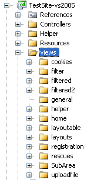

# Views

From the MonoRail perspective the view is in charge of presenting the data supplied by the controller. The controller is not aware of how the view is implemented, nor the underlying view engine you chose. This is intentional and is what separation of concerns is all about.

## Folder Structure Convention

There must be a folder for the views. Each subfolder should be named after the controller's name. If the controller is associated with an area, that must be reflected on the structure as well.



## Selecting a View to Render

When an action is invoked, MonoRail pre-selects the action name as the view to be rendered. For example:

```csharp
using Castle.MonoRail.Framework;

public class CustomerController : Controller
{
    public void Index()
    {
    }
}
```

If the action `Index` is invoked (from a client's browser) the `views\customer\index` view file will be preselected.

**File extensions:** MonoRail will never use file extensions on the controller to define the view to be rendered. Every View Engine uses a different file extension, but that is not reflected on the controller's code.

If instead of sending the `views\customer\index` the programmer wanted to send a different view, she could use the `RenderView` method which selects a different view:

```csharp
using Castle.MonoRail.Framework;

public class CustomerController : Controller
{
    public void Index()
    {
        RenderView("welcome");
    }
}
```

The code above will select a view file located at `views\customer\welcome`.

:warning: **View processing:** The view is not processed when RenderView is invoked. It just selects the view. The view process happens after the action method returns.

## Passing Values to a View

### The PropertyBag

You would probably want to supply data to the view so it can generate dynamic content. This should be done using the `PropertyBag`. For example:

```csharp
using Castle.MonoRail.Framework;

public class TestController : Controller
{
    public void ShowTime()
    {
        PropertyBag["now"] = DateTime.Now;
    }
}
```

The `PropertyBag` is a dictionary. Every View Engine uses an approach to make the data available to the view. Using NVelocity View Engine as an example, the data will be present as a context variable. The following is a small NVelocity template example:

```html
<html>
  Hello, the time now is $now
</html>
```

For further examples of how to access the `PropertyBag` from other view engines see the View Engines section.

### Flash

Flash is a way to persist a transient value between requests. It is useful when you perform some process and issue a redirect. On the redirect target you can check the `Flash` for a status code, error message or something equivalent. For example:

```csharp
using Castle.MonoRail.Framework;

public class AdminController : Controller
{
    public void PasswordManagement()
    {
    }

    public void ChangePassword()
    {
        string passwd = Params["password"];

        if (passwd.Length < 6)
        {
            Flash["error"] = "Password too weak, operation aborted";
        }
        else
        {
            // Change password
        }

        RedirectToAction("PasswordManagement");
    }
}
```

The flow might be not clear in the example above. So, let's see what exactly happens:

* The user accesses the action `PasswordManagement`.
* A page with some action appears, including a change password form that posts to the `ChangePassword` action.
* On the `ChangePassword` action we perform a naive check and, in the event of failure, add an entry to the `Flash`.
* We send the user back to the `PasswordManagement` action sending a redirect.
* The view for the `PasswordManagement` needs to check the `Flash` entry error and show a meaningful error message accordingly.

## Shared Views

Some views could be shared among controllers, or you might want to render a view from another controller. For those cases, use `RenderSharedView`:

```csharp
using Castle.MonoRail.Framework;

public class CustomerController : Controller
{
    public void Index()
    {
        RenderSharedView("common/welcome");
    }
}
```

The code above will select a view file located at `views\common\welcome`.

## Cancelling a View

Although it might sound strange, there are situation were you do not want any view processing to take place. For those cases, use the `CancelView` method.

```csharp
using Castle.MonoRail.Framework;

public class CustomerController : Controller
{
    public void Index()
    {
        CancelView();
    }
}
```

## Accessing Values Passed by the Controller

Each view engine accesses the values in the `PropertyBag` and `Flash` differently. See the ViewEngines section for further information.

## Javascript, Ajax and JSON

MonoRail provides integrated support for Javascript related development tools such as [AJAX](http://en.wikipedia.org/wiki/Ajax_(programming)) and [JSON](http://en.wikipedia.org/wiki/JSON) with your views.  For further information on how to use these technologies with MonoRail see the topic entitled [AJAX and JSON](ajax-and-json.md).