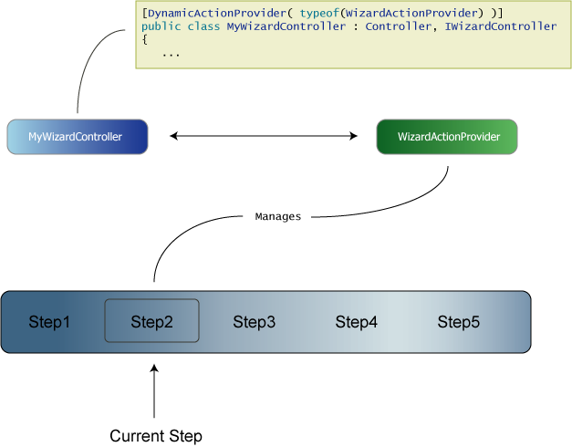

# Wizards

Wizards can be created easily on MonoRail, but first you must understand what entities are involved and what role they play.

* The wizard controller: A controller must be a wizard parent. You can have as many wizards on a web site as you want. All you need to do is using the `WizardActionProvider` and implement the interface `IWizardController`
* `WizardActionProvider`: This is a built in action provider that manages the wizard flow per user. It takes care of starting the wizard, initializuing the steps and delegating the execution to the active step.
* Steps: Each wizard is composed of at least one step. Each step is a controller that extends from `WizardStepPage`.

Check the flow on the image below:



## Wizard Controllers

The wizard controller is just an ordinary controller that might extend Controller or SmartDispatcherController or any other you might have in your controller hierarchy. The only two important things you must do is:

* Bind the controller to the WizardActionProvider
* Implement the interface IWizardController

At this point you may be wondering why we have decided to expose wizard support through an interface and a dynamic action provider. The answer lie on the same reason why Dynamic action were created, we should not mess up with your controller hierarchy. If you're just playing with MonoRail for now you might not be able to foresee the problems that might arise if we introduce and force you to extend a specific controller class. In the end of the day we didn't want to copy & paste the use of filters, layouts and resources from our base controller to the wizard controller.

This architectural decision allows you to reuse (vertically) your controller hierarchy, thus not being intrusive to your controller object model.

To bind your controller to an action provider, use the attribute `DynamicActionProviderAttribute`:

```csharp
[DynamicActionProvider(typeof(WizardActionProvider))]
public class MyWizardController : Controller, IWizardController
{
	...
```

This action provider, when executed by the framework, will check whether the controller is implementing the interface `IWizardController`. So the next logical step is to properly implement it.

To do so, you must at least provide empty bodies for the following IWizardController's methods:

* `void OnWizardStart()`
* `bool OnBeforeStep(string wizardName, string stepName, WizardStepPage step)`: return true if you don't want to block any step from being executed
* `void OnAfterStep(string wizardName, string stepName, WizardStepPage step)`

But you must implement the method `GetSteps` which is the heart of the wizard feature:

```csharp
public WizardStepPage[] GetSteps(IRailsEngineContext context)
{
	return new WizardStepPage[] {
		new IntroductionStep(),
		new MainInfoStep(),
		new SubscribeStep(),
		new ConfirmationStep(),
		new ResultStep()
	};
}
```

Each step is a class that extends `WizardStepPage`. The order that you create the array and return it from `GetSteps` is the order in which the steps will be presented to the user.

## Wizard Action Provider

The `WizardActionProvider` is responsible for:

* Making the step's actions available
* Using the session to store the current wizard step
* Delegating execution to nested actions

First, when this dynamic action is invoked by MonoRail the action start is added to the wizard controller, so you can point your browser to:

`http://yourhost/mywizard/start.rails`

To start the wizard. This is not required, though but it is a good way to ensure the state is cleaned. If you direct the browser to any specific step, the wizard will start itself correctly if it does not find the proper entries in the session.

## Steps

The `GetSteps` method returns an array of `WizardStepPage` which you should extend to create your own steps. For example, a very simple wizard step would be:

```csharp
public class IntroductionStep : WizardStepPage
{
}
```

Not surprisingly this will rely on defaults to work. So when this step is invoked it will just render the view named `IntroductionStep` (`IntroductionStep.vm`, `IntroductionStep.aspx` or `IntroductionStep.boo` depending on the view engine you're using) which **must be on the view folder for the MyWizard controller**.

However `WizardStepPage` provide a few lifecycle methods that can be overriden:

Method | Description
-------|------------
`void Initialize(Controller wizardController)` | This can be overriden but it's important to invoke the base implementation
`void Reset()` | Invoked when the wizard is being access from the start action. Implementors should perform session clean up (if they actually use the session) to avoid stale data on forms
`string ActionName { get; }` | If you want to customize the step name. Defaults to the step's class name
`void RenderWizardView()` | Used to decide on which view to render

And the good news: the WizardStepPage is nothing but a class extending `SmartDispatcherController`, so you can (and should) create your own methods to perform the step work.

To access a step you should direct your browser to

`http://yourhost/mywizard/stepname.rails`

where stepname stands for the value returned by the property `ActionName` defaulting to the class name. So if you want to access the `IntroductionStep` we just mentioned, you should use:

`http://yourhost/mywizard/introductionstep.rails`

## Nested Actions

What we have seen so far is not enough to create a decent wizard. If you want to use ajax on a step for example, what do to? How to save a form from a step?

To solve these problems nested actions were introduced. Nested actions are handled by the `WizardActionProvider` and we're basically talking about accessing a step and then an action it holds.

Being a bit more concrete, suppose you have coded the following step:

```csharp
	public class AccountInfoStep : WizardStepPage { }
```

And on the view side you present a form gathering information from the user. You can create an action just like you would on any controller:

```csharp
public class AccountInfoStep : WizardStepPage
{
	public void Save( ... )
	{
	}
}
```

Now the trick part. To access a nested action you must use:

`stepname - actioname`

So you have to change the form action on the view to

```html
<form action="AccountInfo-Save.rails" method="post"> ...
```

Please note that the action is just like a regular action, so you must redirect the user at the end or provide a view to be rendered after it's execution.

## DoNavigate

Using the same Save example, suppose that you want to direct the user to the next wizard step (if the data is OK). In this case you should invoke the method `WizardActionProvider.DoNavigate()`:

```csharp
public class AccountInfoStep : WizardStepPage
{
	public void Save( ... )
	{
		try
		{
			// validates the data and if it's not ok, throw an exception .. work work work ..

			DoNavigate();
		}
		catch(Exception ex)
		{
			Flash["error"] = ex;
			RedirectToAction(ActionName);
		}
	}
}
```

`DoNavigate` is a black box method, but it's easy to understand it. For most of the times you use it, it would be just like you were invoking the method `RedirectToNextStep`, however you can use a form field named `navigate.to` to customize where it should go:

* If `navigate.to` is previous, `DoNavigate` will invoke `RedirectToPreviousStep`
* If `navigate.to` is first, `DoNavigate` will invoke `RedirectToFirstStep`
* If `navigate.to` is empty or not specified, `DoNavigate` will invoke `RedirectToNextStep`
* If `navigate.to` starts with `uri:`, `DoNavigate` will invoke `Redirect` with the specified URL
* Otherwise `DoNavigate` will assume that the specified text on `navigate.to` is a step name and will invoke `InternalRedirectToStep` with the specified value

## Conditional Steps

You can associate conditions with steps.

TODO: More information needed about this.

## The WizardHelper

The `WizardHelper` is automatically added to the wizard controller and the steps. You can use it to create links to previous and next steps and to query whether there's a previous or next step.

TODO: More information needed about this.

## Windsor Integration

If you are using Windsor Integration, then it's up to you to make the steps components or not.

To use the steps as components, register them within the container (configuration file or via code) and code your wizard controller like this:

```csharp
[DynamicActionProvider(typeof(WizardActionProvider))]
public class MyWizardController : Controller, IWizardController
{
	private readonly IKernel kernel;

	public MyWizardController(IKernel kernel)
	{
		this.kernel = kernel;
	}

	public WizardStepPage[] GetSteps(IRailsEngineContext context)
	{
		return new WizardStepPage[] {
			(WizardStepPage) kernel[ typeof(IntroductionStep) ],
			(WizardStepPage) kernel[ typeof(MainInfoStep) ],
			(WizardStepPage) kernel[ typeof(SubscribeStep) ],
			(WizardStepPage) kernel[ typeof(ConfirmationStep) ],
			(WizardStepPage) kernel[ typeof(ResultStep) ]
		};
	}
	...
}
```